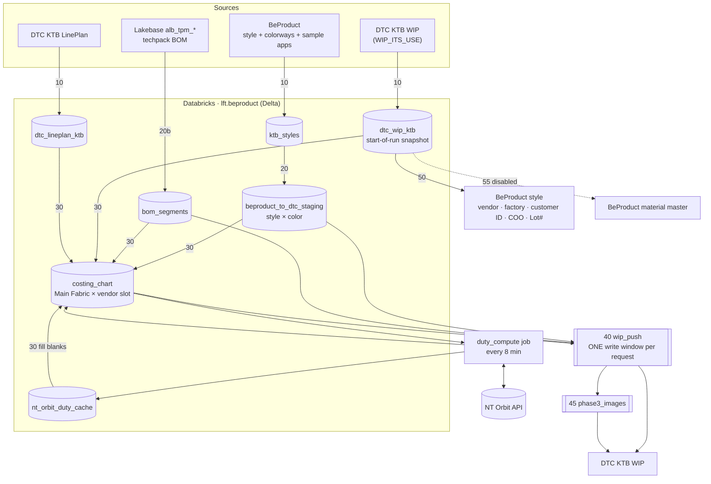
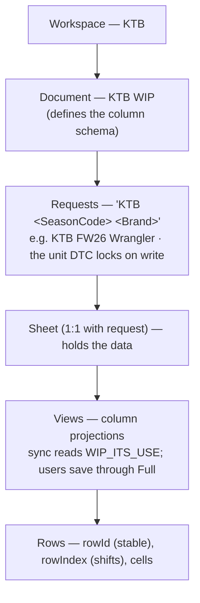

# Architecture — BeProduct ⇄ DTC Sync on Databricks

Bi-directional synchronization between **BeProduct** (style PLM) and **DTC**
("Data Collab" sheets), staged through **Databricks / Delta** under Unity Catalog
schema `lft.beproduct`.

This document is the single reference for **systems**, **repository layout**, and
the **data model on Azure Databricks (ADB)**.

Stage ordering, the task graph and gating conditions are NOT here — they live
in [PIPELINE.md](PIPELINE.md). Diagnosing a symptom: [TROUBLESHOOTING.md](TROUBLESHOOTING.md).

| Looking for | Read |
|---|---|
| What runs, in what order, and what gates a row | [PIPELINE.md](PIPELINE.md) |
| A record / field / costing line / duty is missing or wrong | [TROUBLESHOOTING.md](TROUBLESHOOTING.md) |
| Which field goes which way, keys, PATCH allow-list | [SYNC_CONTRACT.md](SYNC_CONTRACT.md) |
| Why v2 exists, what changed, rollout and rollback | [MIGRATION_V1_V2.md](MIGRATION_V1_V2.md) |
| Per-side API/SDK surface and tables | [DTC_GUIDE.md](DTC_GUIDE.md), [BEPRODUCT_GUIDE.md](BEPRODUCT_GUIDE.md) |
| Verified API behaviour, invariants, decisions log | [../AGENTS.md](../AGENTS.md) |
| The v1 phase-numbered documents | [v1/](v1/) — archived, still the historical record |

Field-level SSOTs (fieldIds, JSONPaths, raw column names):
`beproduct_style_interested_fields.txt` (style),
`costing_interested_fields.txt` (costing_chart columns),
`beproduct_directory_xts_interested_fields.txt` (Directory/XTS),
`beproduct_material_interested_fields.txt` (Stage 55 material target; Phase 8 part retired).
Direction, keys and the PATCH allow-list: [SYNC_CONTRACT.md](SYNC_CONTRACT.md).

---

## 1. Systems

| System | What it is | Access |
|--------|------------|--------|
| **BeProduct** | Style PLM. Parent/child JSON model: `STYLE` header ↔ `Colorways`, `Size`, `BOM`. One environment, data partitioned by **Folder** (e.g. `KTB`). | OAuth 2.0 + Python SDK (`beproduct`) |
| **DTC** | Excel-like data-entry tool. `Workspace → Document → Request → Sheet → View`. Project data lives denormalized in one flat wide sheet per request. | REST API, `x-api-key`; envs **UAT** / **PROD** |
| **Databricks** | Staging + compute. All tables under `lft.beproduct`. Notebooks orchestrate; pure logic is unit-tested Python modules. | `databricks` CLI / SDK |

**Timezones:** BeProduct timestamps are UTC. DTC returns UTC but expects input in
the user-profile timezone (treated as **+08:00 HKT** here).

---

## 2. Repository layout

`v2` marks notebooks/modules introduced by the v2 revamp; everything else is
carried over unchanged. See [MIGRATION_V1_V2.md](MIGRATION_V1_V2.md) for which
v1 artifacts are retired vs. still deployed.

```
beproduct/                            # BeProduct-side notebooks (also host the cross-platform push)
├── 00_init_style_app_registry.py     # Cache folder application IDs → beproduct_style_app_registry
├── p1p7_beproduct_style_sync.py      # BeProduct API → ktb_styles (+ sample-app status)
├── p5utl_beproduct_master_data_sync.py  # Admin: pull/push-back MasterData (dropdowns) + Directory
├── p1p7_beproduct_to_dtc_transform.py  # v2 Stage 20: ktb_styles → staging (style × color)
├── p1_dtc_request_manager.py         # v2 Stage 25: resolve / CREATE / SHARE requests → dtc_request_mapping
├── p3_beproduct_to_dtc_images.py     # v2 Stage 45: front image → DTC "Style Image" (folded into the main DAG 2026-09-15)
├── p0_xts_master_to_directory_upsert.py  # v2 Stage 00: XTS Master → BeProduct Directory upsert
├── p1utl_dtc_share_requests.py       # Idempotent request-sharing backfill
├── p1p7_beproduct_to_dtc_push.py     # v1 Phase 1 push — superseded by v2_wip_push
├── wait_cluster.py                   # v1 cold-start sentinel — unused on serverless
└── orchestrate_sync.py               # RETIRED — single-notebook fallback only

dtc/
├── notebooks/
│   ├── 00_init_request_registry.py   # Standalone WIP registry build/refresh
│   ├── 00_init_season_mapping.py     # Seed dtc_seasoncode_mapping
│   ├── p0_pull_xts_master_to_delta.py   # v2 Stage 00: DTC XTS Master → Delta
│   ├── p1_pull_masters_to_delta.py   # v2 Stage 10: KTB WIP sheets → dtc_wip_ktb + registry
│   ├── p9a_pull_lineplan_to_delta.py # v2 Stage 10: KTB LinePlan → dtc_lineplan_ktb
│   ├── p9a_build_costing_chart.py    # v2 Stage 30 (wip_effective_mode=intent): staging × WIP × LinePlan → costing_chart
│   ├── v2_pull_bom_segments.py       # v2 Stage 20b: Lakebase techpack BOM → bom_segments
│   ├── v2_wip_push.py                # v2 Stage 40: THE single DTC write window
│   ├── v2_push_customer_code.py      # v2 Stage 55: DTC customer code → BeProduct material master
│   ├── p2_push_dtc_to_beproduct.py   # v2 Stage 50: DTC → BeProduct pushback
│   ├── p9b1_compute_duty_rates.py    # duty_compute job: NT Orbit → nt_orbit_duty_cache + costing_chart
│   ├── v2_inspect_requests.py        # read-only: every DTC request and why it is in / out of scope
│   ├── v2_set_dtc_cell.py            # set ONE DTC cell safely (matched, read back)
│   ├── v2_probe_*.py / v2_smoke_check.py  # live probes / serverless smoke check
│   ├── p10_pull_bom_and_enrich.py    # v1 Phase 10 — folded into v2_pull_bom_segments + v2_wip_push
│   ├── p9b2_push_duty_to_wip.py      # v1 Phase 9b push — folded into v2_wip_push
│   ├── p9b_fill_duty_rates.py        # SUPERSEDED 2026-09-03 — manual-fallback artifact only
│   └── p8a_pull_fabric_to_delta.py   # RETIRED 2026-09-01 (MaterialLib) — manual fallback only
├── python/                           # Importable modules (deployed as Workspace files)
│   ├── client/rest_client.py         # Generic REST client (retry, multipart)
│   ├── client/entra_auth.py          # Entra ID delegated OAuth2 (NT Orbit)
│   ├── connectors/dtc.py             # DTC API connector
│   ├── connectors/nt_orbit.py        # NT Orbit Duty Tools connector
│   └── sync/
│       ├── wip_plan.py               # v2: composes phase1 + bom + duty into ONE request plan
│       ├── phase1.py                 # BeProduct → DTC upsert core (pure; DEFAULT_FILL_COLS)
│       ├── phase2.py                 # DTC → BeProduct pushback core (pure)
│       ├── phase3.py                 # Image upload planning + type classification (pure)
│       ├── bom.py                    # BOM parsing + enrichment decision tree (pure)
│       ├── duty.py                   # COSTING_KEY, cache staleness, WIP duty columns (pure)
│       ├── lifecycle.py              # Terminal-status staging eligibility (pure)
│       ├── bom_push.py               # Stage 55 customer-code push planner (pure)
│       ├── samples.py                # Sample-app submit formatter (pure)
│       ├── xts_master.py             # Stage 00 Directory extraction (pure)
│       └── registry.py               # Shared registry refresh (discover→enrich→merge)
└── tests/                            # Unit + live tests for the pure cores

standalone/beproduct_style_push.py    # Standalone Delta → BeProduct push-back (not in the pipeline)
scripts/
├── upload_notebooks.py               # Deploy notebooks + modules (--root selects v1 / v2 workspace root)
├── deploy_job.py                     # Create / reset jobs (--job main|duty_compute|images|v2)
├── run_v2_job.py / run_v2_task.py    # Run the v2 job / one notebook and collect exit JSON
├── _adhoc.py                         # One-off runs as a dev-tagged throwaway job (never jobs.submit)
├── check_dtc_view.py                 # DTC view column check
└── nt_orbit_oauth_setup.py           # One-time Entra delegated-OAuth seeding
docs/                                 # This documentation set (docs/v1/ = archived v1 phase docs)
```

**Notebook vs module split (invariant):** notebooks can't run locally (Spark /
`dbutils`). Deterministic logic lives in `dtc/python/sync/*.py` (pure Python,
unit-tested); notebooks are thin Spark/IO wrappers around it. All HTTP lives in
`connectors/dtc.py` + `client/rest_client.py`.

---

## 3. Components & data flow

The pipeline runs as **independent Databricks jobs**, all defined in
`scripts/deploy_job.py`:

| Job | Contents | Compute |
|---|---|---|
| `BeProduct_DTC_sync_v2` (367710575109755) | The main DAG — Stages 00–55, **including `phase3_images`** (folded in 2026-09-15); every 8 min, periodic trigger (since 2026-09-30) | serverless |
| `BeProduct_DTC_sync_duty_compute` (1026599988408090) | NT Orbit lookups → `nt_orbit_duty_cache` + `costing_chart`; zero DTC contact; every 8 min, periodic trigger | serverless (moved off classic 2026-09-15) |
| `BeProduct_DTC_sync_images` (847087837807970) | Style Image upload — **superseded and PAUSED**; its task now runs inside the v2 DAG | classic |
| `BeProduct_DTC_sync_dag` (294837488757511) | **v1 main job** — PAUSED after the v2 cutover; kept for rollback | classic + pool |

**Two live jobs, not four.** The instance pool is kept at `min_idle_instances=0`
— only the two paused rollback jobs still reference it.

**Cost tags (2026-10-06).** Every job, job-cluster spec and the instance pool
carries `userpurpose = lft-kontoor-sync` (`deploy_job.JOB_TAGS` /
`CLUSTER_TAGS`). One-off and ad-hoc runs carry `lft-kontoor-dev`.
`runs/submit` cannot be tagged, so `scripts/_adhoc.py` runs them as a
throwaway tagged job named `kontoor_adhoc_*`, pruned after 7 days.

> **The task graph, every stage and every gate live in [PIPELINE.md](PIPELINE.md).**
> This section covers only the architectural shape; that document is
> authoritative on ordering and conditions, and is not duplicated here.

The shape worth knowing at this level:

- **One DTC write window per request per run.** Every WIP `sheetData` write in
  the main job happens in `wip_push` (Stage 40) and nowhere else: a PATCH of
  updates keyed by `rowId`, then a POST of inserts to `.../rows` for which DTC
  assigns the locators — back to back. This is forced by DTC's request-level
  optimistic locking: any write moves the request's server-side `last_read` and
  invalidates every browser session that loaded earlier.
- **Planning is separate from writing.** Stages 20–30 compute the intended state
  into Delta (`beproduct_to_dtc_staging`, `bom_segments`, `costing_chart`)
  touching no DTC; Stage 40 diffs that intent against one live read per request
  and writes once. A run that changes nothing writes nothing.
- **Reads are cheap, writes are not.** Only writes move `last_read`, so the
  pipeline reads DTC freely (`pull_master_dtc`, `pull_lineplan_dtc`, plus
  `wip_push`'s own live read) and writes as rarely as possible.
- **Two write streams, adjacent.** `wip_push` (JSON `sheetData`) and
  `phase3_images` (Stage 45, binary multipart `/images`, addressed by `rowid`).
  They cannot be merged — DTC rejects any `sheetData` write to `Style Image` —
  so images runs immediately after `wip_push`, giving one disruption period per
  run.



Stage 00 (DTC XTS Master → BeProduct Directory) is omitted here for clarity;
see PIPELINE.md.

Phase 8a/8b (DTC FABRIC → BeProduct Material Master) are RETIRED (2026-09-01),
replaced by a separate "MaterialLib" application.

### Field ownership, keys, scope

Owned by [SYNC_CONTRACT.md](SYNC_CONTRACT.md) — direction partition, every key,
the PATCH allow-list and the in-scope request-name rule. Not repeated here.

### Denormalization and the material dimension

Staging is one row per **style × colour** — or exactly one row with
`Color / Wash = "NO BP COLORWAY"` for a style with zero colorways. The material
dimension is **not** in staging: Stage 40 fans each style × colour out into one
physical DTC row per BOM segment (`bom_segments`), at plan time against the
live sheet. New rows start with `Fabric Group` / `Mill Fabric Article #` =
`"NO TPM BOM"` and are upgraded in place once the BOM arrives. Each staging row
carries `beproduct_style_id` and `colorway_id` so Stage 50 can write back by id.

### Season mapping (forward-only)

DTC identifies a season as `(Customer, SeasonCode)`; BeProduct as
`(Customer, Season, Year)`. `SeasonCode = DTCCODE + last 2 digits of the year`,
e.g. `SPRING + 2028 → SS28`. Only the **prefix** (`SS`/`FW`) is looked up from
`dtc_seasoncode_mapping`; the year is algorithmic. Applied in the transform; Stage 50
never reverse-maps it (season is a fixed per-request key). A BeProduct season
with no mapping row makes the transform fail (see TROUBLESHOOTING.md 1.1).

---

## 4. DTC organization & identity



- **In-scope request name:** `<customer> <seasonCode> <brand>`, minus the
  lifecycle-word and `-SUPPLIER` exclusions — the full rule is in
  [SYNC_CONTRACT.md](SYNC_CONTRACT.md) → Scope.
- **View:** sync always reads **`WIP_ITS_USE`** (complete, unfiltered projection).
  Requests whose registered view is anything else are skipped + logged.
- **Row locators:** `rowId` (UUID) is the stable one — UPDATE (PATCH) and image
  upload (`rowid`) use it. INSERT (POST `.../rows`) carries no locator; DTC
  assigns both. `rowIndex` (int) shifts on every insert/delete and is only used
  for DELETE (max ~11 rows per call) and deterministic tie-breaks. In-request
  match key is `(BP Style#, Color / Wash)`.

---

## 5. Data model on ADB (`lft.beproduct`)

### BeProduct source tables

| Table | Grain | Key columns / notes |
|-------|-------|---------------------|
| `ktb_styles` | 1 row / style | `id`, `bp_style_number` (header_number; was `lf_style_number`), `lf_style_number` (new separate field), `brand` (brand_hk) — `brands` (brands_multi) REMOVED 2026-09-03, `brand` is now the only brand field —, `gender`, `season`, `year`, `product_status` (all statuses kept; Finalized / Drop are filtered in the transform), `description`, `product_category`, `product_sub_category`, `division`, `garment_finish`, `techpack_stage`, `customer_style_number`, `lot_code`, `parent_vendor`, `factory`; `colorways_json`; `front_image_url`; **6 sample-app columns** `{proto,preline,sms,fit,pp,top}_sample_json` (JSON arrays of submit×size records; transform formats into DTC status strings via `sync.samples`); `data_json`; timestamps |
| `beproduct_style_app_registry` | 1 row / (folder × app) | Cache of folder-constant application IDs (`00_init_style_app_registry`). `folder_name`, `app_id`, `app_title`, `app_type`, `is_sample`, `column_prefix`, `registered_at`. Sync reads `is_sample=true` to know which apps to `app_get`. |
| `beproduct_master_*` | 1 row / valid choice | 11 tables (brands, teams, seasons, years, product_status, product_category, product_sub_category, division, techpack_stage, parent_vendor, factory); columns `field_id`, `value`, `code`, `active`, `data_json`, `synced_at`. `garment_finish` omitted — free-text field, no choices. Used to validate dropdown/multiselect values before push-back. Written (and optionally pushed back to BeProduct) by `p5utl_beproduct_master_data_sync`. |
| `beproduct_directory` | 1 row / company | Directory of vendors, factories, and partners. Columns: `id` (BeProduct UUID, null for new records), `directory_id` (human-readable code), `name`, `partner_type`, `address`, `country`, `state`, `zip`, `city`, `phone`, `fax`, `website`, `notes`, `active`, `data_json`, `synced_at`. `id = NULL` rows are Added; `id = <uuid>` rows are Updated on next push. Matched by **`(name, partner_type)`** (Stage 00 upsert), not `directory_id`. |
| `beproduct_directory_contacts` | 1 row / contact | Contacts within a directory company. Columns: `directory_id` (parent company UUID), `contact_id` (null = new), `email`, `first_name`, `last_name`, `title`, `mobile_phone`, `work_phone`, `role`, `active`, `data_json`, `synced_at`. |

Details + BeProduct API/SDK usage: `BEPRODUCT_GUIDE.md`.

### Integration tables

| Table | Grain | Purpose / key columns |
|-------|-------|-----------------------|
| `beproduct_to_dtc_staging` | 1 row / (style × color) | Denormalized push source (Stage 20). `dtc_request_name`, `bp_style_number` (match key), `lf_style_number`, `color`, `colorway_id`, `beproduct_style_id`, `brand` (brand_hk), `season_code`, every BeProduct → DTC style field, sample status columns (`{proto,preline,sms,fit,pp,top}_sample_status`), `supplier` (constant "Supplier"), `front_image_url`, `sync_status` |
| `bom_segments` | 1 row / style | Stage 20b. Raw techpack BOM `custom_fields` from Lakebase, plus `main_fabric_count`, `fabric_count`, `parse_error`, `bp_style_number`, `style_season`, `extracted_at`. Parsed by `sync/bom.py` at plan time. |
| `dtc_request_mapping` | 1 row / resolved request | `environment`, `dtc_request_name`, `request_id`, `sheet_id`, `view_id`, `season_code`, `brands`, `resolved_at`. Overwritten each run; consumed by the push. |
| `dtc_seasoncode_mapping` | 1 row / (customer, season) | `CUSTOMER`, `BPSEASON`, `DTCCODE` (prefix only). Forward-only. |
| `beproduct_to_dtc_sync_log` | 1 row / operation | BeProduct→DTC audit. `stage` ∈ {`resolve`,`create`,`share`,`registry_audit`,`wip_push`,`images`}; the `lf_style_number` column holds the BP Style#, `operation`, `status`, `reason`, `detail`, `payload`, match key, `run_id`, `log_time`. |
| `dtc_to_beproduct_sync_log` | 1 row / operation | Stage 50 audit (DTC→BeProduct). |

### DTC tables

| Table | Grain | Purpose / key columns |
|-------|-------|-----------------------|
| `dtc_request_registry` | 1 row / request | WIP request control table. `environment`, `request_id`, `view_id`, `customer`, `season_code`, `brands`, `sheet_id`, `request_reference`, `document_name`, `in_scope`, `request_is_active`, `row_count`, `last_extracted`, `last_pushed`, `msgs`. Upserted (`mode=merge`); absent-from-scan in-scope rows are **marked** inactive, not deleted. |
| `dtc_wip_<customer>` | 1 row / DTC sheet row | Pulled `WIP_ITS_USE` data (e.g. `dtc_wip_ktb`). Fixed columns: `bp_style_number` (Phase 6 match key), `lf_style_number`, `color_wash`, `row_id`, `row_index`, `extracted_at`, `data_json` (full row JSON — **only populated cells**; a column blank on every row is absent, so check the view definition, not this table, for "does the column exist"). |
| `dtc_fabric_<customer>`, `dtc_fabric_registry` | *(DROPPED 2026-09-01)* | Retired Phase 8a outputs. |
| `dtc_lineplan_<customer>` | 1 row / LinePlan row | Stage 10 (`pull_lineplan_dtc`), every active LinePlan request, no name filter. `lineplan_ref`, `projected_volume`, `target_ldp`, `target_fob`, `internal_sourced` (raw LinePlan "INTERNAL/ SOURCED" — captured here but NOT joined into `costing_chart`'s `supplier_type`, see below), `gender`, `category`, `product_line`, `region`, `season_launched`, `data_json`. |
| `dtc_lineplan_registry` | 1 row / LinePlan request | LinePlan registry. |
| `dtc_xts_master_ktb` | 1 row / kept XTS sheet row | Stage 00. `partner_type` (SUPPLIER/FACTORY/MILL), `name`, `directory_id`, `country`, always-NULL optional cols (no address/phone/etc. exist in XTS Master), `request_id`, `request_reference`, `view_name`, `data_json`. Brand-config rows (`Type="Brand"`/`"Fabric Brand"`) already filtered out at pull time. |
| `dtc_xts_master_registry` | 1 row / XTS Master request | Stage 00 registry: `partner_type`, `request_id`, `request_reference`, `sheet_id`, `view_id`, `view_name`, `row_count`, `last_extracted`, `msgs`. |
| `costing_chart` | 1 row / (style × color × material × vendor slot) | Stage 30 output; only **Main Fabric** rows. Key `duty.COSTING_KEY`: `[customer, season_code, brand, bp_style_no, lf_style_no, color_name, lineplan_ref, material_no, supplier_type, supplier, factory]` (null-safe comparisons required). `supplier_type` = `"Main"\|"1"\|"2"\|"3"` GENERATED from which WIP vendor/factory column-pair the row came from (per original spec "Supplier Type - Generated from Master Chart data"; corrected 2026-09-01 — this is NOT LinePlan's "INTERNAL/ SOURCED", which does not flow into this table at all). `hts_code`/`duty_rate_*`/`tariff_rate` filled by `duty_compute` (NT Orbit). Full overwrite each Stage 30 run; the values survive because Stage 30 re-reads all five from the **live DTC WIP columns** and then refills any blank from `nt_orbit_duty_cache`. `tariff_rate` joined that WIP fallback on 2026-09-17 when its DTC columns went live, which is what made the former Step 4b carry-forward redundant. **All five are fill-blank-only**, so an already-populated but outdated value is never corrected — that is what `force_refresh_duty` exists for (PIPELINE.md → duty_compute; TROUBLESHOOTING.md runbook 5). **Has real downstream readers (the `duty_compute` job MERGEs it; `wip_push` reads it).** Routine runs write it directly; to build a comparison copy without replacing it, override `costing_chart_table_name`. Recovery for a bad build is Delta time travel (`RESTORE TABLE … VERSION AS OF <n>`), since the table is fully overwritten every run regardless. |
| `nt_orbit_duty_cache` | 1 row / (product_description, origin_country, import_country) | `duty_compute` PERSISTENT cross-run cache (never wiped by Stage 30) — avoids re-paying the ~30s/call NT Orbit cost every run. Nominally stale after `cache_ttl_days` (default 180), but **that TTL is unreachable for a populated row**: a market is only queried when its cell is blank, so a filled row's entry is never examined (live-confirmed 2026-09-17). `force_refresh_duty=true` is the only thing that re-queries it. **The key is the rendered `product_description`**, so anything that changes that text (e.g. a change in `fabric_content` notation or a `sub_class` backfill) silently re-keys the whole cache. NT Orbit is also **not fully deterministic** — an identical request has returned a different HTS ~2h apart — so "same input → same output" is not a reliable premise. |
| `nt_orbit_oauth_state` | 1 row (latest) | duty_compute — persisted rotated Entra `refresh_token` (`dbutils.secrets` is read-only, so this table is the actual live credential store after the first seed). |

- **Keys:** see [SYNC_CONTRACT.md](SYNC_CONTRACT.md) → Keys.
- Per-request metadata lives in the row columns + the registry (no `TBLPROPERTIES`).

---

## 6. Security

- All credentials in the Databricks secret scope **`beproduct`**:
  BeProduct OAuth (`client_id`, `client_secret`, `refresh_token`, `company_domain`)
  DTC keys (`dtc_api_key_uat`, `dtc_api_key_prod`), and NT Orbit Entra
  (`nt_orbit_tenant_id`, `nt_orbit_client_id`, `nt_orbit_client_secret`,
  `nt_orbit_refresh_token` — the live rotated token is in `nt_orbit_oauth_state`).
- No credentials in code/config. Environment-specific DTC keys (UAT/PROD).
- Local deploy uses `.env` (`DATABRICKS_HOST`, `DATABRICKS_PAT`).

---

## 7. Where things are verified

`../AGENTS.md` is the durable log of **live-validated** API behaviour and project
invariants (DTC write/create/share contracts, BeProduct schema quirks, the
field-direction partition). Update it (and the SSOT field file) before changing any
field mapping.
