# BeProduct ⇄ DTC Sync — Pipeline Data-Flow Diagram

> Databricks-centred view of all implemented sync pipelines. Updated
> 2026-09-10 to reflect the current repo: the pipeline is **3 independent
> Databricks jobs** (split 2026-09-03 — see AGENTS.md decisions log):
> `BeProduct_DTC_sync_dag` (main, unchanged job ID 294837488757511, 20 tasks
> — Phase 0/1/2/10/9a + Phase 9b's DTC WIP push), `BeProduct_DTC_sync_duty_compute`
> (single task, NT Orbit → `costing_chart` only, zero DTC dependency), and
> `BeProduct_DTC_sync_images` (single task, Phase 3 image upload only). All 3
> share a Databricks Instance Pool for fast cluster warm-up while remaining
> fully independent — separate schedules, separate clusters per run. Also
> reflects (superseding the 2026-09-08 note below, kept for history):
> Phase 10's BOM source **CHANGED AGAIN 2026-09-09** ("2nd revision") to
> `customer_teckpack_style_log.custom_fields` (via `customer_teckpack_style_
> latest.latest_techpack_style_log_id`, which is now only used to resolve
> which log row is current, NOT the BOM data itself); Phase 10's field
> mapping corrected (`**SupplierRefNo`/`**MaterialContent`/etc., not
> `material_no`/`material_name`); a live "frozen row" Mill Fabric Article #
> blank-backfill fix and a per-colorway segment-coverage fix, both
> 2026-09-10; the `"(BACKUP)"` request-name exclusion extended from Phase 0
> (XTS Master) to the much larger DTC WIP document, also 2026-09-10; and
> the new Phase 2 COO field (`country_of_origin`, DTC 2-char code →
> BeProduct country name via `beproduct_master_coo`), 2026-09-09. Phase
> 8a/8b (FABRIC → Material Master) remain retired, superseded by a separate
> "MaterialLib" application. Gate (`gate_phase*`) tasks and control/audit
> tables are shown explicitly.
>
> **Render locally:**
> ```bash
> npx -y @mermaid-js/mermaid-cli -i docs/DIAGRAM.md -o /tmp/diagram.svg -b white
> ```
> PNG/SVG renders are not committed — generate on demand from this source.

```mermaid
flowchart TB

%% ─── External systems ────────────────────────────────────────────────────────

    subgraph BP ["☁  BeProduct  (Style PLM)"]
        direction TB
        BP_API(["BeProduct SDK\nOAuth 2.0  refresh_token"])
    end

    subgraph DTC ["☁  DTC  (Data Collab  UAT/PROD)"]
        direction TB
        DTC_XTS(["KTB XTS Master\nSupplier + Factory requests\nMill Master out of scope"])
        DTC_WIP(["KTB WIP\nWIP_ITS_USE  204 cols\nview 69f04983…"])
        DTC_LP(["KTB LinePlan\nFull  30 cols\nview 69f07885…"])
    end

    subgraph ORBIT ["☁  NT Orbit Duty Tools  (3rd party)"]
        direction TB
        ORBIT_API(["orbitduty.neotangent.com\nEntra ID delegated OAuth2\n(auchunkei@lifung.com)"])
    end

    subgraph LAKEBASE ["⚡  alb_tpm_uat / alb_tpm_prd  (Lakebase, Unity Catalog)"]
        direction TB
        BOM_SRC(["customer_teckpack_style_latest (resolves latest log id)\n+ customer_teckpack_style_log.custom_fields JSON (actual BOM data, 2026-09-09)\nSERVERLESS compute ONLY"])
    end

%% ─── Azure Databricks ────────────────────────────────────────────────────────

    subgraph ADB ["⚡  Azure Databricks  ·  lft.beproduct  (Unity Catalog)"]
        direction TB

        subgraph DELTA ["Delta Lake"]
            direction LR

            subgraph DELTA_P0 ["Phase 0"]
                direction TB
                T_XTS[("dtc_xts_master_ktb\npartner_type  name\ndirectory_id  country")]
                T_XTSREG[("dtc_xts_master_registry")]
                T_DIR[("beproduct_directory\nmatch key: name+partner_type\nid IS NULL → pending push")]
            end

            subgraph DELTA_WIP ["Phases 1 / 2 / 3 / 7"]
                direction TB
                T_STYLES[("ktb_styles\nbp_style_number  lf_style_number\nbrand  gender  customer_style_number\n6 × sample_json  colorways_json\nFinalized+Drop excluded")]
                T_APPREG[("beproduct_style_app_registry\n6 sample-app IDs  per folder")]
                T_SEASON[("dtc_seasoncode_mapping")]
                T_STAGING[("beproduct_to_dtc_staging\nbp_style_number ← key\nbrand  season_code  color\n6 × sample status cols\nsupplier='Supplier'\ncolorway_id  beproduct_style_id")]
                T_WIP[("dtc_wip_ktb\nbp_style_number  lf_style_number\ncolor_wash  row_id  data_json")]
                T_REG[("dtc_request_registry\n+ dtc_request_mapping")]
                T_LOG1[("beproduct_to_dtc_sync_log")]
                T_LOG2[("dtc_to_beproduct_sync_log")]
            end

            subgraph DELTA_CC ["Phases 9a / 9b"]
                direction TB
                T_LP[("dtc_lineplan_ktb\nlineplan_ref  projected_volume\ntarget_ldp  target_fob\ninternal_sourced")]
                T_LPREG[("dtc_lineplan_registry")]
                T_CC[("costing_chart\nStyle × Color × Material × Slot\nmaterial_no in COSTING_KEY\nhts_code/duty_rate_* via WIP fallback\ntariff_rate carried fwd from PRIOR table state\nMain Fabric rows ONLY (2026-09-07)")]
                T_CACHE[("nt_orbit_duty_cache\nPERSISTENT, never wiped\nkey: description+origin+market\nttl 180d")]
                T_OAUTH[("nt_orbit_oauth_state\nrotated refresh_token\n(dbutils.secrets is read-only)")]
            end
        end

        subgraph DAG ["🔵 BeProduct_DTC_sync_dag  (MAIN job, 294837488757511, 20 tasks)"]
            direction TB

            SW["wait_cluster\ncold-start sentinel"]

            subgraph DAG_P0 ["Phase 0"]
                direction TB
                G0{{"gate_phase0\nrun_phase0"}}
                P0P["phase0_pull\np0_pull_xts_master_to_delta"]
                P0U["phase0_upsert\np0_xts_master_to_directory_upsert"]
                P0X["phase0_push\np5utl_..._sync\nmode=PUSH_DIRECTORY"]
            end

            subgraph DAG_WIP ["Phases 1 / 2 / 7"]
                direction TB
                S1["bp_style_sync\nexcl. Finalized+Drop\n+ sample enrichment"]
                S2["transform\nbrand=brand_hk\nsample UDFs (Phase 7)"]
                S3["pull_master_dtc\n+ registry refresh"]
                S4["request_manager\ncreate + share"]
                S5["phase1_push\nBP→DTC Phases 1+7\nrun_phase1 checked INSIDE\n(no gate task -- see note)"]
                G2{{"gate_phase2\nrun_phase2"}}
                S6["phase2_push\nDTC→BP vendor/factory/lot"]
                S7["repull_dtc\nprereq for Phase 10 ONLY\n(unconditional, no gate)"]
            end

            subgraph DAG_10 ["Phase 10 (BEFORE costing chart)"]
                direction TB
                S10A["fill_bom_data\nSERVERLESS compute (Lakebase)\nrun_phase10 checked INSIDE\n(no gate task -- see note)"]
                S10B["repull_dtc_bom\nunconditional re-pull"]
            end

            subgraph DAG_CC ["Phase 9a + Phase 9b (push half only)"]
                direction TB
                G9A{{"gate_phase9a\nrun_phase9a"}}
                S9A1["pull_lineplan_dtc"]
                S9A2["build_costing_chart\nWIP × LinePlan join\n4-slot transpose\nMain Fabric rows ONLY\ntariff_rate carry-fwd"]
                G9B{{"gate_phase9b\nrun_phase9b"}}
                S9B2["push_duty_rates\np9b2_push_duty_to_wip\ndiff-checked PATCH"]
            end
        end

        subgraph JOB_DUTY ["🟣 BeProduct_DTC_sync_duty_compute  (independent job, 1 task)"]
            direction TB
            S9B1["compute_duty_rates\np9b1_compute_duty_rates\nNT Orbit → costing_chart ONLY\nzero DTC dependency"]
        end

        subgraph JOB_IMG ["🟢 BeProduct_DTC_sync_images  (independent job, 1 task)"]
            direction TB
            S8["phase3_images\nfront image binary\nrun_phase3 checked INSIDE\n(no gate task, own job)"]
        end
    end

%% ─── Phase 0 (DTC XTS Master → BeProduct Directory) — runs FIRST ───────────
    SW      --> G0
    G0      ==>|"true"| P0P
    DTC_XTS ==>|"search_requests\nSupplier+Factory only"| P0P
    P0P     ==> T_XTS
    P0P     ==> T_XTSREG
    T_XTS   --> P0U
    T_DIR   --> P0U
    P0U     ==>|"MERGE\nname+partner_type key"| T_DIR
    P0U     --> P0X
    T_DIR   --> P0X
    P0X     ==>|"PUSH_DIRECTORY\nid IS NULL OR modified_at>extracted_at"| BP_API
    P0X     --> P0X_DONE(("run_if=ALL_DONE\ndisabled run_phase0\nnever deadlocks rest"))

%% ─── WIP chain (Phases 1 / 2 / 3 / 7) ───────────────────────────────────────
    P0X     -.->|"run_if=ALL_DONE"| S1
    BP_API  ==>|"pull styles\nattributes_list + app_get×6"| S1
    T_APPREG --> S1
    S1      ==> T_STYLES
    T_STYLES ==> S2
    T_SEASON --> S2
    S2      ==> T_STAGING
    P0X     -.->|"run_if=ALL_DONE"| S3
    DTC_WIP ==>|"get_sheet×75\nsearch_requests"| S3
    S3      ==> T_WIP
    S3      ==> T_REG
    T_STAGING --> S4
    T_REG   --> S4
    S4      -->|"POST /sheets\nPOST /shares"| DTC_WIP
    S4      --> T_LOG1
    S4      ==> S5
    T_STAGING --> S5
    T_REG   --> S5
    S5      ==>|"PATCH  BP Style#/Color key\nPhase 1+7 fields\nSupplier default-fill\n(no-op + exit if run_phase1=false)"| DTC_WIP
    S5      --> T_LOG1
    S4      --> G2
    T_STAGING --> G2
    T_REG   --> G2
    G2      ==>|"true"| S6
    T_WIP   --> S6
    T_STAGING --> S6
    S6      ==>|"attributes_update\nVendor/Factory/Customer Factory Code/Lot#"| BP_API
    S6      --> T_LOG2
    S5      -.->|"run_if=ALL_DONE"| S7
    DTC_WIP -->|"targeted re-pull\ninserted_ids from phase1_push"| S7
    S7      --> T_WIP

%% ─── Phase 3 images — INDEPENDENT job, no task-graph edges to the main job ──
%% Split out 2026-09-03 (own job, BeProduct_DTC_sync_images). Needs nothing
%% from the main job's SAME run: reads T_REG/T_STAGING (left behind by
%% whichever main-job run most recently populated them) and does its own
%% live DTC get_sheet() read immediately before writing. run_phase3 is
%% checked INSIDE the notebook (2026-09-08 fix -- was a dead job parameter
%% for several days after the 2026-09-03 split left it unwired).
    T_REG     -.->|"left behind by main job's\nmost recent request_manager run"| S8
    T_STAGING -.->|"left behind by main job's\nmost recent transform run"| S8
    S8      ==>|"POST images\nmultipart  blank cells only\n(live get_sheet read first)"| DTC_WIP
    S8      --> T_LOG1

%% ─── Phase 8a/8b RETIRED 2026-09-01 (superseded by MaterialLib) ─────────────
%% Previously: DTC_FAB ==> pull_fabric_dtc ==> dtc_fabric_ktb. Removed from
%% the DAG entirely (not just gated off) — see AGENTS.md decisions log.
%% p8a_pull_fabric_to_delta.py remains in the repo as a manual-fallback
%% artifact only; dtc_fabric_ktb/dtc_fabric_registry were DROPPED from Delta
%% the same day (owner-confirmed, zero downstream readers).

%% ─── Phase 10 — BOM enrichment (runs BEFORE costing chart) ─────────────────
%% NOTE (2026-09-02): deliberately NO gate_phase1 / gate_phase10 condition
%% task on phase1_push / fill_bom_data, unlike every other phase -- a
%% condition-gated task becomes EXCLUDED (not skipped) when its run_phase*
%% flag is false, and Databricks propagates EXCLUDED downstream
%% UNCONDITIONALLY (ignoring run_if), breaking the whole Phase 9/10 chain
%% behind it. Both flags are instead checked INSIDE their notebook
%% (dbutils.notebook.exit as a no-op). fill_bom_data depends on repull_dtc
%% (S7), NOT pull_master_dtc (S3) directly -- it must enrich the COMPLETE
%% post-Phase-1 style x color state, which only repull_dtc makes visible in
%% Delta (S3's snapshot predates phase1_push). SOURCE CHANGED 2026-09-09
%% ("2nd revision"): BOM data now comes from customer_teckpack_style_log.
%% custom_fields (via latest_techpack_style_log_id), NOT bom_unified -- a
%% missing/null custom_fields BOM table means zero action, period (never
%% reverts existing enrichment).
    S7        ==> S10A
    BOM_SRC   ==>|"INNER JOIN\nstyle_no + style_season"| S10A
    S10A      ==>|"PATCH update / INSERT new row\nFabric Group/Placement/Mill Fabric Article #/Content\n(no-op + exit if run_phase10=false)"| DTC_WIP
    S10A      -.->|"run_if=ALL_DONE"| S10B
    S10B      ==> T_WIP

%% ─── Phase 9a — Costing chain (parallel with WIP chain) ────────────────────
    P0X     -.->|"run_if=ALL_DONE"| G9A
    G9A     ==>|"true"| S9A1
    DTC_LP  ==>|"search+get_sheet\nFull view fallback"| S9A1
    S9A1    ==> T_LP
    S9A1    ==> T_LPREG
    T_LP    --> S9A2
    S10B    --> S9A2
    T_CC    -.->|"read own PRIOR state\nfor tariff_rate carry-fwd"| S9A2
    S9A2    ==>|"overwrite\n(Main Fabric rows only)"| T_CC
    S9A2    --> G9B

%% ─── Phase 9b, part 1/2 — NT Orbit compute, INDEPENDENT job ────────────────
%% BeProduct_DTC_sync_duty_compute: single root task, own schedule, ZERO DTC
%% dependency of any kind. Reads/writes ONLY costing_chart + the persistent
%% cache -- never touches live DTC. Not gated by run_phase9b (that param now
%% only controls the main job's push half); pause/resume this job's own
%% schedule to control it instead.
    T_CC      --> S9B1
    T_CACHE   --> S9B1
    T_OAUTH   --> S9B1
    ORBIT_API ==>|"POST /calculate/single/\nonly for cache misses/stale"| S9B1
    S9B1      ==>|"MERGE  COALESCE(new,old)\nper column"| T_CC
    S9B1      ==>|"MERGE  new/refreshed entries"| T_CACHE
    S9B1      -->|"rotated refresh_token"| T_OAUTH

%% ─── Phase 9b, part 2/2 — DTC WIP push, back in the MAIN job ───────────────
%% p9b2_push_duty_to_wip.py: reads whatever costing_chart state the
%% duty_compute job's most recent (independently scheduled) run left behind;
%% diffs each target field against the CURRENT DTC WIP cell before PATCHing,
%% so it's correct regardless of run ordering between the 2 jobs.
    G9B     ==>|"true"| S9B2
    T_CC    --> S9B2
    S9B2    -.->|"PATCH HTS/Duty (US/CA/MX)\n(Tariff Rate: no live WIP col yet,\nstays costing_chart-only)"| DTC_WIP

%% ─── Parallel hints ──────────────────────────────────────────────────────────
    S1 -.->|"parallel"| S3
    S2 -->|"converge"| S4
    S3 -->|"converge"| S4

%% ─── Styles ──────────────────────────────────────────────────────────────────
    classDef ext   fill:#dbeafe,stroke:#2563eb,color:#1e3a8a
    classDef table fill:#f0fdf4,stroke:#16a34a,color:#14532d
    classDef step  fill:#fefce8,stroke:#ca8a04,color:#713f12
    classDef gate  fill:#fee2e2,stroke:#dc2626,color:#7f1d1d
    classDef done  fill:#f3f4f6,stroke:#6b7280,color:#374151,stroke-dasharray: 3 3

    class BP,DTC,ORBIT,LAKEBASE ext
    class T_XTS,T_XTSREG,T_DIR,T_STYLES,T_APPREG,T_SEASON,T_STAGING,T_WIP,T_REG,T_LOG1,T_LOG2,T_LP,T_LPREG,T_CC,T_CACHE,T_OAUTH table
    class SW,P0P,P0U,P0X,S1,S2,S3,S4,S5,S6,S7,S8,S9A1,S9A2,S9B1,S9B2,S10A,S10B step
    class G0,G2,G9A,G9B gate
    class P0X_DONE done
```



---

## Field direction summary

### DTC XTS Master → BeProduct Directory (Phase 0)

Match key: `name` + `partner_type` TOGETHER (not `id`/`directory_id`, not `name`
alone). Pulls `"XTS Supplier Master"` / `"XTS Factory Master"` only (`"XTS Mill
Master"` intentionally out of scope — no real Mill company data exists in
UAT). Brand-level access-sharing rows (`Type="Brand"`) are filtered out at
pull time, distinguished from real company rows by the `Type` column, not by
which sheet they came from. `PUSH_DIRECTORY` mode pushes only rows where
`id IS NULL OR extracted_at IS NULL OR modified_at > extracted_at`.

### BeProduct → DTC (Phase 1 + 7)

| Staging column | DTC column | Phase |
|---|---|---|
| `bp_style_number` | `BP Style#` — match key | 6 |
| `color` | `Color / Wash` — match key | |
| `brand` (brand_hk) | `Brand` — routing key | 6 |
| `product_status` | `Product Status` | 1 |
| `description` | `Style Description` | 1 |
| `product_category` | `Class` | 1 |
| `product_sub_category` | `Sub Class` | 1 |
| `division` | `Division` | 1 |
| `garment_finish` | `Garment Finish` | 1 |
| `techpack_stage` | `Tech Pack Stage` | 1 |
| `fabric_group` | `Fabric Group` (default-fill, INSERT-only — Phase 10 owns ongoing updates) | 1 |
| `placement` | `Placement` (default-fill, INSERT-only — Phase 10 owns ongoing updates) | 1 |
| `gender` | `Gender` | 6 |
| `lf_style_number` | `LF Style#` (optional) | 6 |
| `customer_style_number` | `Legacy Code` (optional) | 6 |
| `supplier` = `"Supplier"` | `Supplier` (default-fill) | 6 |
| `proto_sample_status` | `Proto Sample - Sample Status` | 7 |
| `preline_sample_status` | `Pre-line Sample - Status` | 7 |
| `sms_sample_status` | `SMS - Sample Status` | 7 |
| `fit_sample_status` | `2nd Fit Sample Approval Status` (was `1st Fit ...`) | 7 |
| `pp_sample_status` | `PP Sample Submission Approval Status` (was `2nd Fit ...`) | 7 |
| `top_sample_status` | `TOP Sample Approval Status` | 7 |
| `front_image_url` | `Style Image` (Phase 3, binary) | 3 |

**Default-fill columns** (`Supplier`, `Fabric Group`, `Placement`): written on
INSERT only (new row creation); NEVER re-pushed on UPDATE once the DTC cell
already holds ANY value (placeholder or real) — `diff_updatable_fields()`
skips them once non-blank. `Fabric Group`/`Placement` are Phase 10's fields
going forward (sourced from TPM/BOM data, not BeProduct) — this was a
live-discovered bug fix (2026-09-03): before it, a scheduled Phase 1 run
silently reverted Phase 10's real enrichment back to the placeholder on
every run. `Content` (new DTC WIP column, written by Phase 10 — see below)
is NOT a Phase 1 field at all and does not appear in this table.

### DTC → BeProduct (Phase 2)

| DTC column | BP fieldId | Level |
|---|---|---|
| `Main Vendor (Sampling)` | `parent_vendor` | header |
| `Main Factory (Sampling)` | `factory` | header |
| `Main Factory Customer ID` | `customer_factory_code` (wired up 2026-09-03) | header |
| `Factory Production Country for Main Factory` | `country_of_origin` / "COO" (wired up 2026-09-09; value-transformed 2-char code → country name via `beproduct_master_coo`) | header |
| `Lot#` | `drawing_number_walmart` | colorway |

### DTC FABRIC → Delta (Phase 8a) — ⚠️ RETIRED and DROPPED 2026-09-01

Superseded by a separate "MaterialLib" application, per project team
confirmation; removed from the DAG and this diagram's main flow.
`dtc_fabric_ktb` / `dtc_fabric_registry` were DROPPED from Delta the same
day (owner-confirmed, zero downstream readers). Prior mapping (kept for
history only): `LF Material ID` → `lf_material_id` (BP Material Master key);
`Fabric Content` → `fabric_content` (BP Material Description); `Material
Class`, `Fabric Type`, `Mill Fabric Article #`, `Mill Name`, `KB Fabric Code
(SAP Code)`.

### `alb_tpm_<env>` BOM → DTC WIP `Fabric Group`/`Placement`/`Mill Fabric Article #`/`Content` (Phase 10)

**Source revised again 2026-09-09 ("2nd revision") — supersedes the
`bom_unified` description this section used to have.** The BOM developer
refused to add new fields to `customer_teckpack_style_latest` again; the
actual BOM data now comes from `customer_teckpack_style_log.custom_fields`
(path: `xts_data.TECH_PACK_EXTRACTION.Table[Type="BOM"].ColumnHeader`/
`Data`), fetched via a two-hop join:
`customer_teckpack_style_latest.latest_techpack_style_log_id →
customer_teckpack_style_log.teckpack_style_log_id`. `customer_teckpack_
style_latest` is still used, but only to resolve which log row is current.
Join to `ktb_styles`: `ktb_styles.bp_style_number = ....style_no` AND
`(ktb_styles.season || " - " || ktb_styles.year) = ....style_season` (INNER
JOIN throughout, both hops).

Field mapping (corrected 2026-09-09): `Fabric Group` ← `**MaterialCategory`;
`Placement` ← `**Placement`; `Mill Fabric Article #` ← `**SupplierRefNo`
(NOT `material_no`/`material_name` from the old `bom_unified` shape);
`Content` ← `**MaterialContent` (REINSTATED as a real Phase 10 output —
was briefly removed entirely earlier the same day after the
`bom_unified.material_name` mapping was found pushing material-CODE-shaped
garbage into live DTC for some styles). Runs on **serverless compute**
(source is a Lakebase database) and BEFORE Phase 9a's costing chart build.

Upsert semantics: a row matching a CURRENT segment gets `Placement`/
`Content` upserted independently, only if either changed; a row with a
currently-BLANK `Mill Fabric Article #` is matched to a target sharing its
Fabric Group (disambiguated by Placement if ambiguous) and backfilled
in-place, one-way only (added 2026-09-10 — fixes a live "frozen row" bug,
see `docs/PHASE10_WORKFLOW.md`); an un-enriched row gets the full field set
(first-time enrichment); a row with unrecognized real data is left
untouched; each new "Fabric" segment duplicates every existing row of the
**same colorway** once (segment coverage is scoped PER COLORWAY as of
2026-09-10 — a style's multiple colors are no longer treated as one
combined pool, fixing a live gap where a 2nd color could get permanently
stuck missing its Fabric segments). Blank-vs-blank Placement/Content values
(`None` vs. `""`) are never treated as a diff (added 2026-09-10, avoids a
spurious lean-PATCH violation). See `docs/PHASE10_WORKFLOW.md` for the full,
current spec.

### DTC LinePlan + WIP × LinePlan → Costing Chart (Phase 9a)

Join key: WIP `"Lineplan Ref #"` = LinePlan `"Lineplan Ref #"` (INNER,
2026-09-01). Step 1b completeness filter drops a WIP row if `material_no`
(Mill Fabric Article #), `bp_style_no`, or `fabric_content` (Content) is
blank, if `fabric_content == "Main Fabric"` (guards a historical
mis-sourcing bug), OR — **added 2026-09-07, project team decision** — if
`fabric_group != "Main Fabric"`: Phase 10's "Fabric" segment duplicate rows
are excluded from `costing_chart` entirely, so Duty/Tariff/HTS are only
ever computed for "Main Fabric" rows. Transpose: Main / Vendor 1 / Vendor 2
/ Vendor 3 slots → one row each per vendor. `costing_chart`'s match/MERGE
key (`duty.COSTING_KEY`, shared with the `duty_compute` job) is
`[customer, season_code, brand, bp_style_no, lf_style_no, color_name,
lineplan_ref, material_no, supplier_type, supplier, factory]` —
`material_no` was added 2026-09-03 since Phase 10 can produce multiple WIP
rows per style×color (Main Fabric + Fabric duplicates) that would otherwise
collide on this key. `costing_chart` is FULLY OVERWRITTEN every Phase 9a
run for `hts_code`/`duty_rate_*` (falls back to whatever's on the live WIP
row, so effectively persists once pushed once) — but `tariff_rate` has NO
live WIP fallback, so as of 2026-09-07 it's explicitly carried forward from
the table's OWN prior state (`COALESCE(new, old)` keyed by `COSTING_KEY`)
instead of being wiped every run. `build_costing_chart` depends on
`repull_dtc_bom` (Phase 10's re-pull), not `pull_master_dtc` directly.

### costing_chart → NT Orbit Duty Tools → costing_chart (Phase 9b, part 1 —
### independent `duty_compute` job) / costing_chart → DTC WIP (part 2 —
### `push_duty_rates`, back in the main job)

Split into 2 notebooks/jobs 2026-09-03: `p9b1_compute_duty_rates.py`
(`BeProduct_DTC_sync_duty_compute` job — NT Orbit + cache only, ZERO DTC
dependency) and `p9b2_push_duty_to_wip.py` (`push_duty_rates` task, back in
the MAIN job — reads whatever `costing_chart` state the `duty_compute` job's
most recent run left behind, diffs each target field against the CURRENT
DTC WIP cell before PATCHing, correct regardless of run ordering between
the 2 jobs).

`product_description` = Style Description + Color/Wash + Content + Gender +
Class + Sub Class (concatenated; `color_name` added 2026-09-07 — REVERSES
the earlier design that deliberately shared one cache entry across colors,
since color doesn't affect HS classification — different colors now always
get their own lookup/cache entry); `origin_country_code` =
`export_country_code` = `production_country`; a market needs a call when
its own `duty_rate_xx` is blank, OR (added 2026-09-07, fixes a real bug)
when `tariff_rate` itself is still blank even if `duty_rate_us` is already
filled (previously, once `duty_rate_us` persisted via the WIP fallback, the
US market was considered "already done" forever and `tariff_rate` could
never be backfilled). `duty_rate_xx` = response's "General Duty" line rate
(NOT the combined `data.duty_rate`, which also includes tariff+fees);
`tariff_rate` = sum of other `type="duty"` lines, only ever set from a
US-market call. The PERSISTENT `nt_orbit_duty_cache` table (never wiped,
unlike `costing_chart`) is checked FIRST — a hit within `cache_ttl_days`
(default 180) skips the ~30s API call entirely. `push_duty_rates` PATCHes
HTS/Duty Rate back to the live WIP per-slot columns; Tariff Rate has no WIP column
yet, so it stays in `costing_chart` only.

---

> **Note on job independence**: `duty_compute` and `images` are triggered on
> their own schedules and can run concurrently with `main` or with each
> other. This is safe by design — `compute_duty_rates` never touches DTC at
> all, and `phase3_images`/`push_duty_rates` write through disjoint DTC
> surfaces (binary `/images` endpoint keyed by `rowindex` vs. JSON
> `sheetData` PATCH keyed by `rowId`, touching disjoint columns).
>
> A previous version of this footnote (as of 2026-07-02) flagged `BP Style#`/
> `Gender`/`Supplier` as pending DTC admin migration — all three have since
> been live-confirmed working end-to-end (2026-08-28 onward) and this is no
> longer a caveat.
