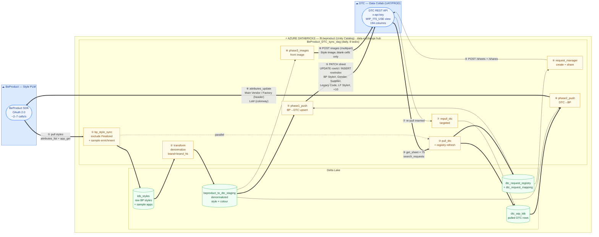

# BeProduct ⇄ DTC Sync — Pipeline Data-Flow Diagram

> Databricks-centred view of the implemented sync pipelines.
> `BeProduct_DTC_sync_dag` — multi-task job, job id 294837488757511. Updated 2026-07-03.



---

## Flow legend

| # | Task | Direction | Databricks table touched | External call |
|---|------|-----------|--------------------------|---------------|
| ① | `bp_style_sync` | BeProduct → ADB | write `ktb_styles` | `attributes_list`, `app_get`×6 |
| ② | `transform` | ADB → ADB | `ktb_styles` → `beproduct_to_dtc_staging` | — |
| ③ | `pull_dtc` | DTC → ADB | write `dtc_wip_ktb` + `registry` | `search_requests`, `get_sheet`×75 |
| ④ | `request_manager` | ADB → DTC | write `dtc_request_mapping` | `POST /sheets`, `POST /shares` |
| ⑤ | `phase1_push` | **BeProduct → DTC** | read `staging` + `mapping` | `PATCH /sheets/{id}/views/{id}` |
| ⑥ | `phase2_push` | **DTC → BeProduct** | read `dtc_wip_ktb` + `staging` | `attributes_update` |
| ⑦ | `repull_dtc` | DTC → ADB | refresh `dtc_wip_ktb` | `get_sheet` (inserted only) |
| ⑧ | `phase3_images` | **BeProduct → DTC** | read `dtc_wip_ktb` + `staging` | `POST .../images` (multipart) |

**Parallelism:** ①→② (BeProduct chain) runs in parallel with ③ (DTC pull); both converge at ④.

---

## Direction summary (one-way per field, no loops)

```
                       ┌─────────────────────────────┐
   BeProduct  ═══════▶ │        DATABRICKS           │ ═══════▶  DTC
   (Phase 1,3)         │  ktb_styles → staging       │  (⑤ PATCH, ⑧ images)
                       │                             │
   BeProduct  ◀═══════ │  dtc_wip_ktb ← DTC pull     │ ◀═══════  DTC
   (Phase 2)           │                             │  (③ get_sheet)
                       └─────────────────────────────┘
```

- **BeProduct → DTC** (Phase 1): Product Status, Style Description, Class, Sub Class,
  Division, Brand, Garment Finish, Tech Pack Stage, Fabric Group, Placement, Gender,
  BP Style# (match key), LF Style#, Legacy Code, Supplier (default-fill).
- **BeProduct → DTC** (Phase 3): Style Image (binary, blank cells only).
- **DTC → BeProduct** (Phase 2): Main Vendor (Sampling), Main Factory (Sampling), Lot#.
- **Match key:** `(BP Style#, Color / Wash)` in-request; `[Customer, BP Style#, SeasonCode, Brand]` composite.
- **Filter:** styles with Product Status = "Finalized" are excluded at ①.
```
