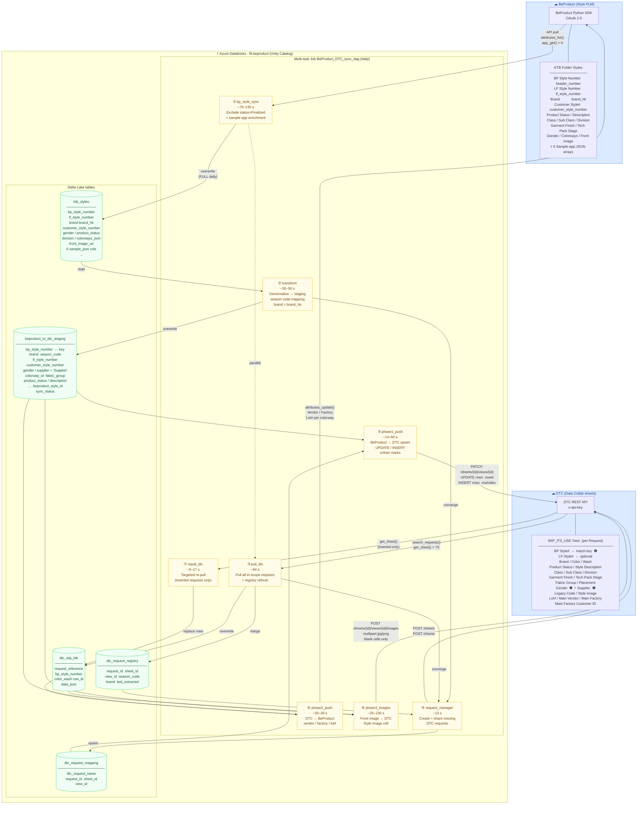

# BeProduct ⇄ DTC Sync — Block Diagram

> High-level data-exchange architecture via Azure Databricks.
> Generated 2026-07-02.

---

## Field direction summary

### BeProduct → DTC (Phase 1)

| Staging column | DTC column | Notes |
|---|---|---|
| `bp_style_number` | `BP Style#` | **match key** ❶ pending DTC col |
| `color` | `Color / Wash` | in-request match key |
| `brand` | `Brand` | from `brand_hk`; constant per request |
| `lf_style_number` | `LF Style#` | optional; upstream-filled |
| `customer_style_number` | `Legacy Code` | optional; upstream-filled |
| `product_status` | `Product Status` | excludes "Finalized" styles |
| `description` | `Style Description` | |
| `product_category` | `Class` | |
| `product_sub_category` | `Sub Class` | |
| `division` | `Division` | |
| `garment_finish` | `Garment Finish` | |
| `techpack_stage` | `Tech Pack Stage` | |
| `fabric_group` | `Fabric Group` | |
| `placement` | `Placement` | |
| `gender` | `Gender` | ❶ pending DTC col |
| `supplier` _(constant_ `"Supplier"`)  | `Supplier` | ❶ pending; default-fill only |
| `front_image_url` | `Style Image` | Phase 3 binary upload only |

### DTC → BeProduct (Phase 2)

| DTC column | BeProduct fieldId | Notes |
|---|---|---|
| `Main Vendor (Sampling)` | `parent_vendor` | header |
| `Main Factory (Sampling)` | `factory` | header |
| `Lot#` | `drawing_number_walmart` | colorway |
| `Main Factory Customer ID` | — | no BP target; skipped |

---

> ❶ Column not yet in DTC view — DTC admin must add.
> After `BP Style#` is added, existing `LF Style#` data must be migrated to `BP Style#`
> and the sync team notified to activate the new match key.
