# BeProduct ⇄ DTC Sync — Pipeline Data-Flow Diagram

> Databricks-centred view of all implemented sync pipelines.
> `BeProduct_DTC_sync_dag` — job 294837488757511, 24 tasks. Updated 2026-09-02
> to reflect the current repo: Phase 0 (XTS Master → Directory), Phase 9b
> (NT Orbit Duty Tools), and Phase 10 (BOM enrichment, runs on SERVERLESS
> compute, placed BEFORE the costing chart) added; Phase 8a/8b (FABRIC →
> Material Master) removed — retired, superseded by a separate "MaterialLib"
> application. Gate (`gate_phase*`) tasks and control/audit tables are shown
> explicitly.
>
> **Render locally:**
> ```bash
> npx -y @mermaid-js/mermaid-cli -i docs/DIAGRAM.md -o /tmp/diagram.svg -b white
> ```
> PNG/SVG renders are not committed — generate on demand from this source.

```mermaid
flowchart TB

%% ─── External systems ────────────────────────────────────────────────────────

    subgraph BP ["☁  BeProduct  (Style PLM)"]
        direction TB
        BP_API(["BeProduct SDK\nOAuth 2.0  refresh_token"])
    end

    subgraph DTC ["☁  DTC  (Data Collab  UAT/PROD)"]
        direction TB
        DTC_XTS(["KTB XTS Master\nSupplier + Factory requests\nMill Master out of scope"])
        DTC_WIP(["KTB WIP\nWIP_ITS_USE  204 cols\nview 69f04983…"])
        DTC_LP(["KTB LinePlan\nFull  30 cols\nview 69f07885…"])
    end

    subgraph ORBIT ["☁  NT Orbit Duty Tools  (3rd party)"]
        direction TB
        ORBIT_API(["orbitduty.neotangent.com\nEntra ID delegated OAuth2\n(auchunkei@lifung.com)"])
    end

    subgraph LAKEBASE ["⚡  alb_tpm_uat / alb_tpm_prd  (Lakebase, Unity Catalog)"]
        direction TB
        BOM_SRC(["customer_teckpack_style_log\nbom_unified JSON\nSERVERLESS compute ONLY"])
    end

%% ─── Azure Databricks ────────────────────────────────────────────────────────

    subgraph ADB ["⚡  Azure Databricks  ·  lft.beproduct  (Unity Catalog)"]
        direction TB

        subgraph DELTA ["Delta Lake"]
            direction LR

            subgraph DELTA_P0 ["Phase 0"]
                direction TB
                T_XTS[("dtc_xts_master_ktb\npartner_type  name\ndirectory_id  country")]
                T_XTSREG[("dtc_xts_master_registry")]
                T_DIR[("beproduct_directory\nmatch key: name+partner_type\nid IS NULL → pending push")]
            end

            subgraph DELTA_WIP ["Phases 1 / 2 / 3 / 7"]
                direction TB
                T_STYLES[("ktb_styles\nbp_style_number  lf_style_number\nbrand  gender  customer_style_number\n6 × sample_json  colorways_json\nFINALIZED excluded")]
                T_APPREG[("beproduct_style_app_registry\n6 sample-app IDs  per folder")]
                T_SEASON[("dtc_seasoncode_mapping")]
                T_STAGING[("beproduct_to_dtc_staging\nbp_style_number ← key\nbrand  season_code  color\n6 × sample status cols\nsupplier='Supplier'\ncolorway_id  beproduct_style_id")]
                T_WIP[("dtc_wip_ktb\nbp_style_number  lf_style_number\ncolor_wash  row_id  data_json")]
                T_REG[("dtc_request_registry\n+ dtc_request_mapping")]
                T_LOG1[("beproduct_to_dtc_sync_log")]
                T_LOG2[("dtc_to_beproduct_sync_log")]
            end

            subgraph DELTA_CC ["Phases 9a / 9b"]
                direction TB
                T_LP[("dtc_lineplan_ktb\nlineplan_ref  projected_volume\ntarget_ldp  target_fob\ninternal_sourced")]
                T_LPREG[("dtc_lineplan_registry")]
                T_CC[("costing_chart\nStyle × Color × Slot\nhts_code  duty_rate_*  tariff_rate\nFULL OVERWRITE each Phase 9a run")]
                T_CACHE[("nt_orbit_duty_cache\nPERSISTENT, never wiped\nkey: description+origin+market\nttl 180d")]
                T_OAUTH[("nt_orbit_oauth_state\nrotated refresh_token\n(dbutils.secrets is read-only)")]
            end
        end

        subgraph DAG ["BeProduct_DTC_sync_dag  (daily, 24 tasks)"]
            direction TB

            SW["wait_cluster\ncold-start sentinel"]

            subgraph DAG_P0 ["Phase 0"]
                direction TB
                G0{{"gate_phase0\nrun_phase0"}}
                P0P["phase0_pull\np0_pull_xts_master_to_delta"]
                P0U["phase0_upsert\np0_xts_master_to_directory_upsert"]
                P0X["phase0_push\np5utl_..._sync\nmode=PUSH_DIRECTORY"]
            end

            subgraph DAG_WIP ["Phases 1 / 2 / 3 / 7"]
                direction TB
                S1["bp_style_sync\nexcl. Finalized\n+ sample enrichment"]
                S2["transform\nbrand=brand_hk\nsample UDFs (Phase 7)"]
                S3["pull_master_dtc\n+ registry refresh"]
                S4["request_manager\ncreate + share"]
                G1{{"gate_phase1\nrun_phase1"}}
                S5["phase1_push\nBP→DTC Phases 1+7"]
                G2{{"gate_phase2\nrun_phase2"}}
                S6["phase2_push\nDTC→BP vendor/factory/lot"]
                G3{{"gate_phase3\nrun_phase3"}}
                S7["repull_dtc\ntargeted re-pull"]
                S8["phase3_images\nfront image binary"]
            end

            subgraph DAG_10 ["Phase 10 (BEFORE costing chart)"]
                direction TB
                S10A["fill_bom_data\nSERVERLESS compute (Lakebase)\nrun_phase10 checked INSIDE\n(no gate task -- see note)"]
                S10B["repull_dtc_bom\nunconditional re-pull"]
            end

            subgraph DAG_CC ["Phases 9a / 9b"]
                direction TB
                G9A{{"gate_phase9a\nrun_phase9a"}}
                S9A1["pull_lineplan_dtc"]
                S9A2["build_costing_chart\nWIP × LinePlan join\n4-slot transpose"]
                G9B{{"gate_phase9b\nrun_phase9b"}}
                S9B["fill_duty_rates\ncache-first, ~30s/call\npush_to_wip"]
            end
        end
    end

%% ─── Phase 0 (DTC XTS Master → BeProduct Directory) — runs FIRST ───────────
    SW      --> G0
    G0      ==>|"true"| P0P
    DTC_XTS ==>|"search_requests\nSupplier+Factory only"| P0P
    P0P     ==> T_XTS
    P0P     ==> T_XTSREG
    T_XTS   --> P0U
    T_DIR   --> P0U
    P0U     ==>|"MERGE\nname+partner_type key"| T_DIR
    P0U     --> P0X
    T_DIR   --> P0X
    P0X     ==>|"PUSH_DIRECTORY\nid IS NULL OR modified_at>extracted_at"| BP_API
    P0X     --> P0X_DONE(("run_if=ALL_DONE\ndisabled run_phase0\nnever deadlocks rest"))

%% ─── WIP chain (Phases 1 / 2 / 3 / 7) ───────────────────────────────────────
    P0X     -.->|"run_if=ALL_DONE"| S1
    BP_API  ==>|"pull styles\nattributes_list + app_get×6"| S1
    T_APPREG --> S1
    S1      ==> T_STYLES
    T_STYLES ==> S2
    T_SEASON --> S2
    S2      ==> T_STAGING
    P0X     -.->|"run_if=ALL_DONE"| S3
    DTC_WIP ==>|"get_sheet×75\nsearch_requests"| S3
    S3      ==> T_WIP
    S3      ==> T_REG
    T_STAGING --> S4
    T_REG   --> S4
    S4      -->|"POST /sheets\nPOST /shares"| DTC_WIP
    S4      --> T_LOG1
    S4      --> G1
    G1      ==>|"true"| S5
    T_STAGING --> S5
    T_REG   --> S5
    S5      ==>|"PATCH  BP Style#/Color key\nPhase 1+7 fields\nSupplier default-fill"| DTC_WIP
    S5      --> T_LOG1
    S4      --> G2
    T_STAGING --> G2
    T_REG   --> G2
    G2      ==>|"true"| S6
    T_WIP   --> S6
    T_STAGING --> S6
    S6      ==>|"attributes_update\nVendor/Factory/Lot#"| BP_API
    S6      --> T_LOG2
    S4      --> G3
    G3      ==>|"true"| S7
    S5      -.->|"run_if=ALL_DONE"| S7
    DTC_WIP -->|"targeted re-pull"| S7
    S7      --> T_WIP
    T_WIP   --> S8
    T_STAGING --> S8
    S8      ==>|"POST images\nmultipart  blank cells only"| DTC_WIP
    S8      --> T_LOG1

%% ─── Phase 8a/8b RETIRED 2026-09-01 (superseded by MaterialLib) ─────────────
%% Previously: DTC_FAB ==> pull_fabric_dtc ==> dtc_fabric_ktb. Removed from
%% the DAG entirely (not just gated off) — see AGENTS.md decisions log.
%% p8a_pull_fabric_to_delta.py remains in the repo as a manual-fallback
%% artifact only; dtc_fabric_ktb/dtc_fabric_registry were DROPPED from Delta
%% the same day (owner-confirmed, zero downstream readers).

%% ─── Phase 10 — BOM enrichment (runs BEFORE costing chart) ─────────────────
%% NOTE: deliberately NO gate_phase10 condition task, unlike every other
%% phase -- a condition-gated fill_bom_data became EXCLUDED (not skipped)
%% when run_phase10=false, and Databricks propagates EXCLUDED downstream
%% UNCONDITIONALLY, breaking the whole Phase 9a/9b chain. run_phase10 is
%% checked INSIDE the notebook instead (dbutils.notebook.exit as a no-op).
    S3        ==> S10A
    T_WIP     --> S10A
    BOM_SRC   ==>|"INNER JOIN\nstyle_no + style_season"| S10A
    S10A      ==>|"PATCH update / INSERT new row\n(no-op + exit if run_phase10=false)"| DTC_WIP
    S10A      -.->|"run_if=ALL_DONE"| S10B
    S10B      ==> T_WIP

%% ─── Phase 9a/9b — Costing chain (parallel with WIP chain) ─────────────────
    P0X     -.->|"run_if=ALL_DONE"| G9A
    G9A     ==>|"true"| S9A1
    DTC_LP  ==>|"search+get_sheet\nFull view fallback"| S9A1
    S9A1    ==> T_LP
    S9A1    ==> T_LPREG
    T_LP    --> S9A2
    S10B    --> S9A2
    S9A2    ==> T_CC
    S9A2    --> G9B
    G9B     ==>|"true"| S9B
    T_CC    --> S9B
    T_CACHE --> S9B
    T_OAUTH --> S9B
    ORBIT_API ==>|"POST /calculate/single/\nonly for cache misses/stale"| S9B
    S9B     ==>|"MERGE  write-once"| T_CC
    S9B     ==>|"MERGE  new/refreshed entries"| T_CACHE
    S9B     -->|"rotated refresh_token"| T_OAUTH
    S9B     -.->|"push_to_wip=true\nPATCH HTS/Duty (no Tariff col yet)"| DTC_WIP

%% ─── Parallel hints ──────────────────────────────────────────────────────────
    S1 -.->|"parallel"| S3
    S2 -->|"converge"| S4
    S3 -->|"converge"| S4

%% ─── Styles ──────────────────────────────────────────────────────────────────
    classDef ext   fill:#dbeafe,stroke:#2563eb,color:#1e3a8a
    classDef table fill:#f0fdf4,stroke:#16a34a,color:#14532d
    classDef step  fill:#fefce8,stroke:#ca8a04,color:#713f12
    classDef gate  fill:#fee2e2,stroke:#dc2626,color:#7f1d1d
    classDef done  fill:#f3f4f6,stroke:#6b7280,color:#374151,stroke-dasharray: 3 3

    class BP,DTC,ORBIT,LAKEBASE ext
    class T_XTS,T_XTSREG,T_DIR,T_STYLES,T_APPREG,T_SEASON,T_STAGING,T_WIP,T_REG,T_LOG1,T_LOG2,T_LP,T_LPREG,T_CC,T_CACHE,T_OAUTH table
    class SW,P0P,P0U,P0X,S1,S2,S3,S4,S5,S6,S7,S8,S9A1,S9A2,S9B,S10A,S10B step
    class G0,G1,G2,G3,G9A,G9B gate
    class P0X_DONE done
```



---

## Field direction summary

### DTC XTS Master → BeProduct Directory (Phase 0)

Match key: `name` + `partner_type` TOGETHER (not `id`/`directory_id`, not `name`
alone). Pulls `"XTS Supplier Master"` / `"XTS Factory Master"` only (`"XTS Mill
Master"` intentionally out of scope — no real Mill company data exists in
UAT). Brand-level access-sharing rows (`Type="Brand"`) are filtered out at
pull time, distinguished from real company rows by the `Type` column, not by
which sheet they came from. `PUSH_DIRECTORY` mode pushes only rows where
`id IS NULL OR extracted_at IS NULL OR modified_at > extracted_at`.

### BeProduct → DTC (Phase 1 + 7)

| Staging column | DTC column | Phase |
|---|---|---|
| `bp_style_number` | `BP Style#` — match key | 6 |
| `color` | `Color / Wash` — match key | |
| `brand` (brand_hk) | `Brand` — routing key | 6 |
| `product_status` | `Product Status` | 1 |
| `description` | `Style Description` | 1 |
| `product_category` | `Class` | 1 |
| `product_sub_category` | `Sub Class` | 1 |
| `division` | `Division` | 1 |
| `garment_finish` | `Garment Finish` | 1 |
| `techpack_stage` | `Tech Pack Stage` | 1 |
| `fabric_group` | `Fabric Group` | 1 |
| `placement` | `Placement` | 1 |
| `gender` | `Gender` | 6 |
| `lf_style_number` | `LF Style#` (optional) | 6 |
| `customer_style_number` | `Legacy Code` (optional) | 6 |
| `supplier` = `"Supplier"` | `Supplier` (default-fill) | 6 |
| `proto_sample_status` | `Proto Sample - Sample Status` | 7 |
| `preline_sample_status` | `Pre-line Sample - Status` | 7 |
| `sms_sample_status` | `SMS - Sample Status` | 7 |
| `fit_sample_status` | `2nd Fit Sample Approval Status` (was `1st Fit ...`) | 7 |
| `pp_sample_status` | `PP Sample Submission Approval Status` (was `2nd Fit ...`) | 7 |
| `top_sample_status` | `TOP Sample Approval Status` | 7 |
| `front_image_url` | `Style Image` (Phase 3, binary) | 3 |

### DTC → BeProduct (Phase 2)

| DTC column | BP fieldId | Level |
|---|---|---|
| `Main Vendor (Sampling)` | `parent_vendor` | header |
| `Main Factory (Sampling)` | `factory` | header |
| `Lot#` | `drawing_number_walmart` | colorway |
| `Main Factory Customer ID` | — (skipped) | — |

### DTC FABRIC → Delta (Phase 8a) — ⚠️ RETIRED and DROPPED 2026-09-01

Superseded by a separate "MaterialLib" application, per project team
confirmation; removed from the DAG and this diagram's main flow.
`dtc_fabric_ktb` / `dtc_fabric_registry` were DROPPED from Delta the same
day (owner-confirmed, zero downstream readers). Prior mapping (kept for
history only): `LF Material ID` → `lf_material_id` (BP Material Master key);
`Fabric Content` → `fabric_content` (BP Material Description); `Material
Class`, `Fabric Type`, `Mill Fabric Article #`, `Mill Name`, `KB Fabric Code
(SAP Code)`.

### `alb_tpm_<env>` BOM → DTC WIP `Fabric Group`/`Placement`/`Mill Fabric Article #` (Phase 10)

Join key: `ktb_styles.bp_style_number = customer_teckpack_style_log.style_no`
AND `(ktb_styles.season || " - " || ktb_styles.year) = style_season`. Parses
`bom_unified` JSON for "Main Fabric" (exactly 1) and "Fabric" (0+) segments;
`Fabric Group` = the segment's own `bom_detail_name`, not `material_name`.
Runs on **serverless compute** (source is a Lakebase database) and BEFORE
Phase 9a's costing chart build, so up-to-date material names reach Phase
9b's NT Orbit calls. See `docs/PHASE10_WORKFLOW.md`.

### DTC LinePlan + WIP × LinePlan → Costing Chart (Phase 9a)

Join key: WIP `"Lineplan Ref #"` = LinePlan `"Lineplan Ref #"`.
Transpose: Main / Vendor 1 / Vendor 2 / Vendor 3 slots → one row each per vendor.
`costing_chart` is FULLY OVERWRITTEN every Phase 9a run (no incremental).
`build_costing_chart` depends on `repull_dtc_bom` (Phase 10's re-pull), not
`pull_master_dtc` directly.

### costing_chart → NT Orbit Duty Tools → costing_chart / DTC WIP (Phase 9b)

`product_description` = Style Description + Content + Gender + Class + Sub
Class (concatenated); `origin_country_code` = `export_country_code` =
`production_country`; one call per still-blank market (US/CA/MX).
`duty_rate_xx` = response's "General Duty" line rate (NOT the combined
`data.duty_rate`, which also includes tariff+fees); `tariff_rate` = sum of
other `type="duty"` lines, only ever set from a US-market call. The
PERSISTENT `nt_orbit_duty_cache` table (never wiped by Phase 9a, unlike
`costing_chart`) is checked FIRST — a hit within `cache_ttl_days` (default
180) skips the ~30s API call entirely. `push_to_wip=true` PATCHes HTS/Duty
Rate back to the live WIP per-slot columns; Tariff Rate has no WIP column
yet, so it stays in `costing_chart` only.

---

> ❶ Pending DTC admin action: `BP Style#`, `Gender`, `Supplier` columns confirmed
> present in WIP_ITS_USE view (204 fields as of the 2026-08-28 restructure,
> up from 198) but were last confirmed blank as of 2026-07-02 — need data
> migration from `LF Style#` for `BP Style#` before the match-key switch can
> activate. Re-verify against the live 204-field view before relying on this.
