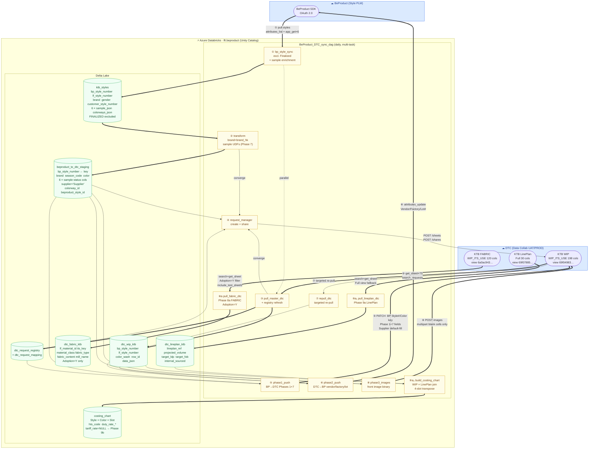

# BeProduct ⇄ DTC Sync — Pipeline Data-Flow Diagram

> Databricks-centred view of all implemented sync pipelines.
> `BeProduct_DTC_sync_dag` — job 294837488757511. Updated 2026-07-18.

---

## Field direction summary

### BeProduct → DTC (Phase 1 + 7)

| Staging column | DTC column | Phase |
|---|---|---|
| `bp_style_number` | `BP Style#` — match key | 6 |
| `color` | `Color / Wash` — match key | |
| `brand` (brand_hk) | `Brand` — routing key | 6 |
| `product_status` | `Product Status` | 1 |
| `description` | `Style Description` | 1 |
| `product_category` | `Class` | 1 |
| `product_sub_category` | `Sub Class` | 1 |
| `division` | `Division` | 1 |
| `garment_finish` | `Garment Finish` | 1 |
| `techpack_stage` | `Tech Pack Stage` | 1 |
| `fabric_group` | `Fabric Group` | 1 |
| `placement` | `Placement` | 1 |
| `gender` | `Gender` | 6 |
| `lf_style_number` | `LF Style#` (optional) | 6 |
| `customer_style_number` | `Legacy Code` (optional) | 6 |
| `supplier` = `"Supplier"` | `Supplier` (default-fill) | 6 |
| `proto_sample_status` | `Proto Sample - Sample Status` | 7 |
| `preline_sample_status` | `Pre-line Sample - Status` | 7 |
| `sms_sample_status` | `SMS - Sample Status` | 7 |
| `fit_sample_status` | `1st Fit Sample Approval Status` | 7 |
| `pp_sample_status` | `2nd Fit Sample Approval Status` | 7 |
| `top_sample_status` | `TOP Sample Approval Status` | 7 |
| `front_image_url` | `Style Image` (Phase 3, binary) | 3 |

### DTC → BeProduct (Phase 2)

| DTC column | BP fieldId | Level |
|---|---|---|
| `Main Vendor (Sampling)` | `parent_vendor` | header |
| `Main Factory (Sampling)` | `factory` | header |
| `Lot#` | `drawing_number_walmart` | colorway |
| `Main Factory Customer ID` | — (skipped) | — |

### DTC FABRIC → Delta (Phase 8a, Adoption=Y)

`LF Material ID` → `lf_material_id` (BP Material Master key); `Fabric Content` → `fabric_content` (BP Material Description); `Material Class`, `Fabric Type`, `Mill Fabric Article #`, `Mill Name`, `KB Fabric Code (SAP Code)`.

### DTC LinePlan + WIP × LinePlan → Costing Chart (Phase 9a)

Join key: WIP `"Lineplan Ref #"` = LinePlan `"Lineplan Ref #"`.
Transpose: Main / Vendor 1 / Vendor 2 / Vendor 3 slots → one row each per vendor.
`tariff_rate = NULL` placeholder (Phase 9b NT Orbit Duty Tools).

---

> ❶ Pending DTC admin action: `BP Style#`, `Gender`, `Supplier` columns confirmed
> present in WIP_ITS_USE view (198 fields) but all cells blank — need data migration
> from `LF Style#` for `BP Style#` before match-key switch can activate.
