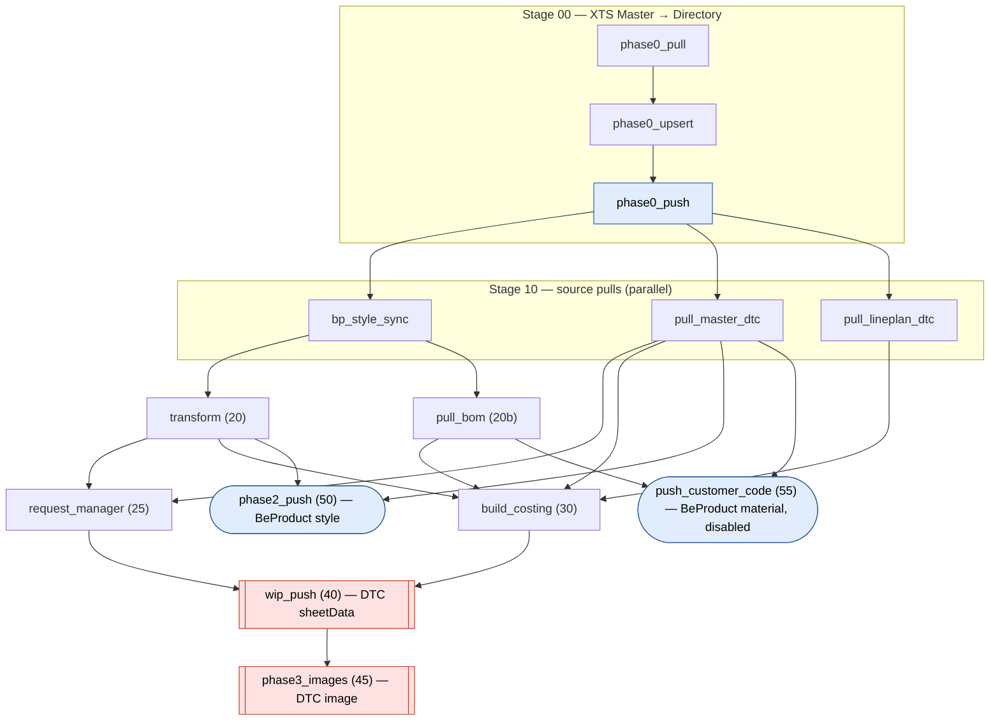
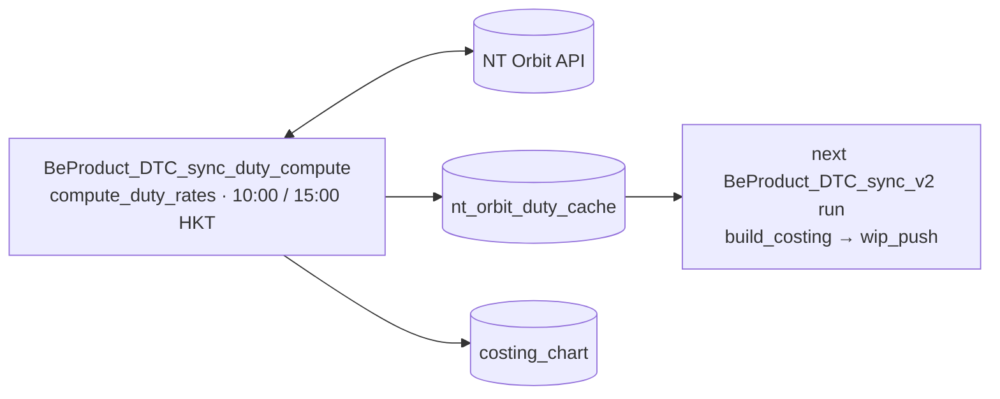

# Pipeline (v2) — stages, tasks, and gates

**Branch `v2`.** This is the single reference for *what runs, in what order, and
what a row must satisfy to progress*. It consolidates four v1 documents:

| v1 document | Fate |
|---|---|
| `PHASE0/1/2/3/5/7/9/10_WORKFLOW.md` | Per-stage sections below; originals archived in [docs/v1/](v1/) |
| `DIAGRAM.md` | "The DAG" below; original archived |
| `PIPELINE_GATES.md` | "Gates" subsections below; original archived |

Field-level mapping is **not** here — see [SYNC_CONTRACT.md](SYNC_CONTRACT.md).
Diagnosing a specific symptom (missing row, field not pushed, no costing line,
missing / outdated duty) — start at [TROUBLESHOOTING.md](TROUBLESHOOTING.md),
which cites the gates below by stage and number.
Why v2 exists and how it differs from v1 — see [MIGRATION_V1_V2.md](MIGRATION_V1_V2.md).
Systems, repo layout and the Delta data model — see [ARCHITECTURE.md](ARCHITECTURE.md).

> **Status: LIVE since 2026-09-15.** `BeProduct_DTC_sync_v2` (job
> 367710575109755) runs serverless every 15 min at :05/:20/:35/:50 HKT (since 2026-09-28; was
> every 2 h); the companion `BeProduct_DTC_sync_duty_compute` (1026599988408090)
> every 15 min at :12/:27/:42/:57 HKT. The v1 jobs `BeProduct_DTC_sync_dag` and `BeProduct_DTC_sync_images`
> are PAUSED, kept only for rollback. `folder_name` is still `TEST KTB` until
> go-live.

---

## The one thing v2 is built around

DTC uses **permissive optimistic locking at request granularity**. Any successful
API write moves the request's server-side `last_read`; every browser session that
loaded earlier is then refused on save ("reload please") and loses in-progress
edits. Confirmed with the DTC developer:

- **Only writes** move the timestamp. Reads are free.
- **Scope is the whole request**, not the view or the row. A write through
  `WIP_ITS_USE` blocks a user editing a different row through a different view.
- DTC is building websocket change-propagation with client-side merge to lift
  this. Not shipped; v2 does not assume it.

So the design objective is **not** "fewer API calls" — it is **the fewest
distinct moments at which a given request is written, packed into the shortest
possible window**. v1 writes each request at up to 5 moments scattered across the
whole DAG. v2 writes it at exactly one point, in ≤2 back-to-back calls.

This is what makes the target cadence (a run every ~2 hours during active style
development) viable at all:

| | Write windows/day | User-visible exposure |
|---|---|---|
| v1 @ 3 runs/day | 9 | ~2 h/day |
| v1 @ 12 runs/day | 36 | ~6–8 h/day — unusable |
| v2 @ 12 runs/day | 12 | minutes |

---

## Design rules

1. **One write *period* per request per run.** Every `sheetData` write happens
   in `wip_push` (Stage 40). `phase3_images` (Stage 45) is the one other DTC
   writer and is irreducibly separate — image cells are writable only through
   the multipart `/images` endpoint, and DTC rejects any `sheetData` write to
   `Style Image`. It runs immediately after `wip_push` so the two windows are
   **adjacent**, not scattered. In steady state it uploads nothing and opens no
   window at all. Adding any further DTC-writing task needs an explicit
   decision recorded in AGENTS.md.
2. **A run that changes nothing must write nothing.** Not an emergent property of
   per-field diffing — an asserted, unit-tested invariant of the plan builder. At
   12 runs/day this is the difference between safe and intolerable.
3. **One write *window* per request — not a fixed call count.** The floor is 2
   calls, not 1: updates go out as a `patch_rows` PATCH keyed by `rowId`, and
   inserts as an `append_rows` POST to `.../rows`, back to back.
   > **Changed 2026-09-23.** Inserts used to be a second PATCH keyed by a
   > CLIENT-COMPUTED `rowIndex`, and the 2-call floor existed because
   > `patch_rows` rejects a body mixing `rowId` and `rowIndex`. They now use the
   > append endpoint, where the SERVER assigns `rowId`+`rowIndex` and a body
   > carrying either is rejected — so no index is computed anywhere, and the
   > stale-read race it carried is gone. Still two calls, still one window; the
   > 201 returns the new rowIds in send order, so inserted rows are logged with
   > the id DTC actually gave them.
   > **This becomes more than 2 calls at scale.** `batch_size` (default 100)
   > chunks each side, so a request with 250 changed rows issues 3 update
   > calls, not 1. They are still consecutive, so it remains **one write
   > window** — which is the property that actually matters to users — but do
   > not quote "≤2 calls" once the real `KTB` folder is in play. See the
   > go-live checklist in [MIGRATION_V1_V2.md](MIGRATION_V1_V2.md).
4. **No condition tasks.** Every `run_*` flag is read as a plain widget inside its
   own notebook, which exits as a SUCCESS no-op when disabled. Databricks
   propagates a condition task's `EXCLUDED` outcome to every downstream dependent
   *unconditionally, ignoring `run_if`* — and v2's chain is linear enough that one
   gate evaluating false would silently excise everything behind it. v1 learned
   this twice (`gate_phase1`, `gate_phase10`, both removed 2026-09-02); v2 adopts
   it as a blanket rule rather than case-by-case.
5. **Serverless everywhere.** No job clusters, no instance pool, no `wait_cluster`.
6. **Plan against live, not against Delta.** `wip_push` does one live `get_sheet()`
   per request and diffs all contributions against that. v1's Phase 10 and 9b
   planned against a Delta snapshot and needed two full re-pulls to stay honest.

---

## The DAG



Red = writes DTC, blue = writes BeProduct; every other task writes Delta only.
Every edge is `run_if=ALL_DONE`. `wip_push` also reads `bom_segments` and
`costing_chart` directly.

**Two jobs, not four** (2026-09-15). `phase3_images` moved INTO this DAG; the
standalone images job is paused and superseded. Only one companion job remains:



---

## Stages

| # | Task | Notebook | Writes | Flag | Depends on |
|---|---|---|---|---|---|
| 00 | `phase0_pull` | `p0_pull_xts_master_to_delta` | Delta `dtc_xts_master_ktb` | `run_phase0` | — |
| 00 | `phase0_upsert` | `p0_xts_master_to_directory_upsert` | Delta `beproduct_directory` | `run_phase0` | `phase0_pull` |
| 00 | `phase0_push` | `p5utl_beproduct_master_data_sync` | **BeProduct** Directory | `run_phase0` | `phase0_upsert` |
| 10 | `bp_style_sync` | `p1p7_beproduct_style_sync` | Delta `ktb_styles` | — | `phase0_push` |
| 10 | `pull_master_dtc` | `p1_pull_masters_to_delta` | Delta `dtc_wip_ktb`, registry | — | `phase0_push` |
| 10 | `pull_lineplan_dtc` | `p9a_pull_lineplan_to_delta` | Delta `dtc_lineplan_ktb` | `run_costing` | `phase0_push` |
| 20 | `transform` | `p1p7_beproduct_to_dtc_transform` | Delta `beproduct_to_dtc_staging` | — | `bp_style_sync` |
| 20b | `pull_bom` | `v2_pull_bom_segments` | Delta `bom_segments` | `run_bom` | `bp_style_sync` |
| 25 | `request_manager` | `p1_dtc_request_manager` | Delta `dtc_request_mapping`; creates DTC requests | — | `transform`, `pull_master_dtc` |
| 30 | `build_costing` | `p9a_build_costing_chart` (`wip_effective_mode=intent`) | Delta `costing_chart` | `run_costing` | `transform`, `pull_bom`, `pull_master_dtc`, `pull_lineplan_dtc` |
| 40 | `wip_push` | `v2_wip_push` | **DTC** WIP `sheetData` | `run_wip_push`, `run_duty_push` | `request_manager`, `build_costing` |
| 45 | `phase3_images` | `p3_beproduct_to_dtc_images` | **DTC** Style Image | `run_phase3` | `wip_push` |
| 50 | `phase2_push` | `p2_push_dtc_to_beproduct` | **BeProduct** style | `run_phase2` | `transform`, `pull_master_dtc` |
| 55 | `push_customer_code` | `v2_push_customer_code` | **BeProduct** material master | `run_customer_code_push` (**false**) | `pull_bom`, `pull_master_dtc` |

Every task also takes `dry_run` (job default `false`); a stage whose flag is
`false` exits SUCCESS with `SKIPPED_run_<flag>_false`, so a disabled stage looks
green in the run UI.

Every dependency edge carries `run_if=ALL_DONE`. A stage that fails should degrade
the run, not abort it — notably `wip_push` still runs (and still pushes style, BOM
and sample data) if `build_costing` failed; it simply contributes no duty fields
that round.

---

### Stage 00 — DTC XTS Master → BeProduct Directory

Unchanged from v1. Pulls the DTC `XTS Master` document (requests
`XTS Supplier Master` / `XTS Factory Master`; `XTS Mill Master` is out of scope)
into `dtc_xts_master_ktb`, upserts into `beproduct_directory` matched on
**`name` + `partner_type` together** — BeProduct's real Directory key, not `id`
and not `name` alone — then pushes rows where
`id IS NULL OR extracted_at IS NULL OR modified_at > extracted_at`.

Flag: `run_phase0`. Writes to **BeProduct**, never to DTC.

**Gates** (`sync/xts_master.py`):
1. Exact `requestReference` match against the 2-name allow-list `XTS_REQUESTS`.
2. Not a brand-config row — a Supplier-view row with `Type == "Brand"` is access
   config, not a company. Factory view has no such exclusion.
3. Non-blank name, else the row is dropped.
4. Dedup on `(name, partner_type)`; a true collision prefers a non-null
   `directory_id`, then the lowest `row_index`.

---

### Stage 10 — Source pulls (parallel)

Three independent roots.

**`bp_style_sync`** — BeProduct styles → `ktb_styles`, including the 6 sample
applications (Proto / PreLine / SMS / Fit / PP / TOP).

> **Cadence warning.** Sample-app enrichment is one `app_get` per (style × app) —
> ~876 calls, ~120 s for KTB — and `refresh_mode` is pinned to `FULL` because app
> changes do not bump `style.modifiedAt`, so INCREMENTAL would miss app-only
> edits. At 12 runs/day that is ~10,500 BeProduct calls/day and it will be the
> largest single runtime item once the DTC passes are merged. Splitting sample-app
> enrichment onto its own slower schedule is tracked as an open item in
> [MIGRATION_V1_V2.md](MIGRATION_V1_V2.md).

**`pull_master_dtc`** — in-scope DTC WIP requests → `dtc_wip_<customer>`. This is
the **only** WIP read that feeds planning; v1's `repull_dtc` and `repull_dtc_bom`
are gone.

**`pull_lineplan_dtc`** — the `KTB LinePlan` document → `dtc_lineplan_<customer>`.

**Gates — request-level scoping** (`phase1.is_in_scope()`, the shared choke point
for `registry.build_registry_row()`, `registry.refresh()`'s pre-filter and
request-creation eligibility). The most upstream gate in the pipeline: excluding a
request here removes its rows from every stage below.

1. **No lifecycle marker word** — case-insensitive, matched at a word boundary
   with any suffix: **cancel / backup / archive / delete**
   (`phase1.EXCLUDED_NAME_WORDS`; the stems are `cancel`, `backup`, `archiv`,
   `delet`, so `cancelled`, `archival` and `deletion` match too). Began as a
   `\(backup`-only rule on 2026-09-10 — 81 of 86 active KTB WIP requests were
   backup-named and were being pulled, the root cause of the long-standing
   "~199/227 rows have a null `bp_style_number`" problem — and was widened to
   the full word list on 2026-09-15 after a live inventory turned up
   `Cancel`-named requests and five named simply `DELETED`. The widening also
   catches a **bare** `BACKUP` with no parentheses, which the original rule
   missed.
2. **No `-SUPPLIER` marker** — case-insensitive `-supplier\b`. DTC generates
   supplier-scoped artifact requests named
   `<customer> <seasonCode> <brand>-SUPPLIER <xxx>`; they are DTC's own
   artifacts, never sync targets. Without this they parse as perfectly valid
   in-scope requests, since the parser takes everything after the season code
   as the brand — four appeared in a single afternoon in UAT.
3. **Parses as `<customer> <seasonCode> <brand>`** — ≥3 whitespace-delimited
   tokens with the 2nd matching `[A-Za-z]{2}\d{2}`.
4. **Customer token matches** (case-insensitive) — `KON …` developer requests out.

> **Combined live effect (2026-09-15):** of 109 requests in the `KTB WIP`
> document, **3** are in scope. Before the two 2026-09-15 rules it was 10. The
> `(BACKUP)`-era duplicate in-scope name
> (`KTB FW26 Cancel Wrangler Global TALISMAN LTD`, present twice with different
> `request_id`s) disappears as a side effect — both copies are `Cancel`-named.
> Read-only inventory: `dtc/notebooks/v2_inspect_requests.py`.

**Exception:** `pull_lineplan_dtc` has its own independent, *unfiltered* discovery
loop and never calls `is_in_scope()` — the project team has not settled a LinePlan
naming convention and explicitly wants backup-named LinePlan requests included
(2026-09-01). Uniqueness of `Lineplan Ref #` across LinePlan requests is therefore
a human-enforced invariant; Stage 30 only warns on conflict, never blocks.

---

### Stage 20 — `transform` → style × color staging

Produces `beproduct_to_dtc_staging` from `ktb_styles`: one row per **style ×
colour**, carrying every BeProduct → DTC field and the computed target request
name `dtc_request_name = "<customer> <seasonCode> <brand>"`. Writes Delta only;
touches no DTC. The same notebook as v1, unchanged.

Staging deliberately stays at style × colour, **not** style × colour ×
material: the material fan-out depends on which segments a colourway is
*already* represented by in live DTC, which the transform cannot see, and
`phase1.compute_upsert()` treats a repeated `(BP Style#, Color / Wash)` as a
`duplicate_bp_key` exception. The BOM is a separate style-keyed table (Stage
20b) and the material dimension is resolved at **plan time** in Stage 40.

**Gates — staging eligibility** (`sync/lifecycle.py`, the transform notebook):

1. **Folder.** Only styles in the BeProduct folder named by `folder_name`
   (currently `TEST KTB`) exist in `ktb_styles` at all.
2. **Colorway presence is not a gate.** A style with zero colorways gets one row
   with `color = DUMMY_COLOR` ("NO BP COLORWAY") rather than being dropped.
   Stage 40 upgrades that row in place the first time a real colorway appears.
3. **Lifecycle** (`should_include_in_staging()`) — non-terminal `Product Status`
   always included; terminal (`Finalized` / `Drop`) included only until the DTC
   row's own `Product Status` has caught up, then excluded until reactivation.
   Fails **open** if the WIP snapshot can't be read. `ktb_styles` keeps terminal
   styles; only staging drops them.
4. **DTC-marked-Dropped** (`is_wip_row_dropped()`, WIP `"Active / Dropped"`) — a
   safe no-op today: the column's real name was never live-verified. Activates
   automatically once confirmed.
5. **Required non-null** — `bp_style_number`, `season_code`, `brand`, `color`.
   A violation **raises and fails the task** rather than skipping the row: a null
   here means an upstream data problem (usually a BeProduct season/year with no
   `dtc_seasoncode_mapping` row) that needs fixing. Because every edge is
   `ALL_DONE`, downstream stages still run — against the **previous** run's
   staging, so new styles silently stop appearing until this is fixed.
6. **Request name format** — `^[A-Z]+ [A-Z]{2}[0-9]{2} .+$`; also a raise.

---

### Stage 20b — `pull_bom` → `bom_segments`

Reads the techpack BOM from the **`alb_tpm_*` Lakebase tables** and writes the
raw payload to Delta, one row per style. Runs in **parallel** with `transform`;
touches no DTC and writes nothing to BeProduct.

Source: `customer_teckpack_style_latest.latest_techpack_style_log_id →
customer_teckpack_style_log.teckpack_style_log_id`, joined to `ktb_styles` on
`(bp_style_number = style_no, season || " - " || year = style_season)`, INNER
JOIN throughout — **a style with no Lakebase row simply has no BOM**. The
payload is `custom_fields`, path
`xts_data.TECH_PACK_EXTRACTION.Table[Type="BOM"]`. The `**`-column → DTC-column
mapping is in [SYNC_CONTRACT.md](SYNC_CONTRACT.md) → "BOM → DTC".

**Gates — BOM presence**:

1. **BOM presence is not a gate for the row.** A style with no resolvable Main
   Fabric segment stages with `DUMMY_FABRIC_GROUP` / `DUMMY_FABRIC_ARTICLE`
   ("NO TPM BOM") and is enriched on a later run. Never an error.
2. Each payload is parsed eagerly; `main_fabric_count`, `fabric_count` and
   `parse_error` are stored per style, so a malformed BOM surfaces in **this**
   task, attributed to a specific style, rather than silently degrading a
   contribution two stages later. The raw `custom_fields` is kept verbatim so
   `sync/bom.py` stays the single BOM parser — Stage 40 re-parses it with the
   very function the unit tests cover.

Flag: `run_bom`. Disabling it leaves whatever the table already holds;
downstream never reverts on missing BOM data.

> **Source history.** From 2026-09-16 to 2026-09-22 the BOM came from
> BeProduct's PageBomVariation API instead; the owner reverted it
> (2026-09-22). That parser is kept dormant but unit-tested in `sync/bom.py`
> ("SOURCE 2"), all consumers sniff either table shape
> (`bom.segments_table_mode()`), and branch `v2-bomvariation` snapshots the
> BeProduct-sourced pipeline — so switching back is a one-notebook redeploy.
> Accepted costs of the revert: `KTB-00029`'s Lakebase placements are blank
> (DTC keeps the values it already has), `Content` notation is
> `"Cotton 97%, Spandex 3%"` (hence write-once, Stage 40), and Stage 55 lost
> its `materialId` (see Stage 55). API access notes and the equivalence
> evidence are in AGENTS.md (2026-09-16 / 2026-09-17 entries).

---

### Stage 25 — `request_manager`

Unchanged from v1. Resolves each pending staging request name against
**active + in-scope** registry rows, writing `dtc_request_mapping`; creates and
shares any missing in-scope request.

- Only in-scope names are created; a brand-less `KTB SS26` logs `NOT_IN_SCOPE`.
- Creation is gated by `dry_run`.
- Sharing (`share_on_create`, default true): all views → `aiagentwip@lifung.com`;
  the Full Version view → the Kontoor Project Team group.
- **Recreate-on-inactive**: a name that previously resolved to a now-inactive
  request falls through to "missing" and is recreated under the same name — there
  is no separate recreate path.
- **Duplicate-name guard**: DTC permits two concurrently-active requests with
  identical names, distinguished only by `requestId`.
  `registry.find_duplicate_active_names()` logs `DUPLICATE_ACTIVE_NAME` and the
  colliding name is neither resolved nor treated as missing, so it is never
  auto-created a third time.

`POST /v1/sheets` body (HTTP 201): `requestReference` (not `requestName`),
non-empty `requestDescription`, `viewName`, and `requestAssigneeSharingViewNames` /
`sheetData` present as arrays (empty `[]` accepted).

Creating a request is a write, but to a request no user has open yet — it does not
violate the one-window rule.

---

### Stage 30 — `build_costing` → `costing_chart`  (shared notebook, "intent" mode)

Same output table and key as v1, different inputs. v1 read the twice-re-pulled
`dtc_wip_<customer>`; v2 runs **before** the push, so its Step 1a overlays the
values `wip_push` is *about to* write onto the start-of-run WIP snapshot, then
joins **LinePlan**:

| Input | Source in v2 | Why |
|---|---|---|
| `material_no`, `fabric_content`, `fabric_group` | `bom_segments` (Stage 20b) | We write these; our plan is authoritative |
| style identity, `sub_class`, `class_name`, `gender`, … | staging (Stage 20) | Same |
| `lineplan_ref`, 4 vendor/factory slots, production country, existing HTS/duty/tariff | `dtc_wip_ktb` (`pull_master_dtc`) | DTC-owned, never written by us — the start-of-run pull is current by definition |

**One representative row per style × colour** feeds costing: the row whose
`Fabric Group` is `Main Fabric`, else the lowest `rowIndex`. So every DTC-owned
input (Lineplan Ref #, vendors, factories) must be entered **on the Main Fabric
row** — values typed on a "Fabric" segment row are not read.

`fabric_type` remains DTC-trigger-only but is traceability-only, never a filter
or key.

Fully overwritten every run, no incremental — recovery for a bad build is
`RESTORE TABLE … VERSION AS OF n`. The exit value reports every gate's drop
count (`gates.dropped_*`, `joined_to_lineplan`, `rows_by_vendor_slot`,
`duty_fields_non_blank`); serverless returns no stdout, so that JSON is the
diagnostic.

**Key** (`duty.COSTING_KEY`): `[customer, season_code, brand, bp_style_no,
lf_style_no, color_name, lineplan_ref, material_no, supplier_type, supplier,
factory]`. `material_no` is in the key because one style × color fans out to
multiple physical rows that would otherwise collide.

> **`COSTING_KEY` joins and MERGEs must use null-safe equality.** `lf_style_no`
> can legitimately be `NULL`. Spark's `t.c = s.c` and the `.join(other, on=[list])`
> shorthand both evaluate `NULL = NULL` to `NULL`, never `TRUE`, so a row with a
> null key column silently never matches itself — no error, no log line. Use `<=>`
> in SQL and `.eqNullSafe()` in PySpark. This bit both call sites simultaneously
> in v1 (fixed 2026-09-10).

**Gates.** A WIP row must clear three independent gates to produce any
`costing_chart` row, and failing any one produces zero rows with no distinguishing
error — this is the most common source of "why isn't my style in `costing_chart`"
(see the `KTB-00030` case in AGENTS.md, 2026-09-10).

*Completeness filter — all four ANDed:*
1. `material_no` (`Mill Fabric Article #`) non-blank.
2. `bp_style_no` non-blank.
3. `fabric_content` (`Content`) non-blank **and** not literally `"Main Fabric"`
   (guards an old placeholder leak).
4. `fabric_group` is **exactly** `"Main Fabric"` — the "Fabric" segment duplicate
   rows are excluded from costing by design, so duty is only ever computed for
   Main Fabric.

*LinePlan INNER JOIN:*
5. `lineplan_ref` non-blank on the row itself — dropped before the join if blank.
6. That ref must actually match a `dtc_lineplan_<customer>` row; an unmatched ref
   is dropped, not carried through with nulls.

*Per vendor slot (Main/1/2/3), independently:*
7. The slot's vendor must be non-blank. Zero populated slots → zero rows; two of
   four → exactly two rows, transposed. A blank **factory** does *not* drop the
   slot — the row forms, but `production_country` is blank, so it never gets a
   duty lookup (see duty_compute gate 1), with no error. Production country is a
   DTC **lookup on the factory**, and DTC only materializes a lookup if the
   column is on the view the user **saved through** ("Full"); otherwise the
   stored cell stays NULL while the UI shows a value (AGENTS.md 2026-09-23).

*Duty back-fill, in order:*
8. **WIP fallback** (Step 4) — all five duty fields (`hts_code`,
   `duty_rate_us|ca|mx`, `tariff_rate`) are re-read from the DTC WIP row's own
   per-slot columns, which is how a value survives this table being fully
   overwritten every run. `tariff_rate` joined this on **2026-09-17**, when its
   DTC columns went live; the old tariff-only Step 4b carry-forward was removed
   the same day.
9. **Cache fill** — every duty field is filled directly from
   `nt_orbit_duty_cache`, read-only, zero API calls. The cache is keyed purely on
   `(product_description, origin_country, import_country)` with no style/color/
   vendor identity, so even a brand-new row is filled the instant its exact
   product+origin+market combination has ever been looked up — including for a
   different style. Reuses the same pure functions the NT Orbit job uses to decide
   whether to call (`markets_needing_lookup`, `cache_key`, `is_cache_entry_stale`,
   `merge_lookup_into_row`), with the API call simply never made. Fill-blank-only
   (it never overrides a value from gate 8, except under `force_refresh_duty`);
   a miss leaves the field `NULL` for `duty_compute` to fill later.

Flag: `run_costing`. Checked inside the notebook — **never** as a condition task,
since `wip_push` depends on this stage.

---

### Stage 40 — `wip_push` → the single DTC write window

Everything that writes to a DTC WIP request. Replaces v1's `phase1_push` (Phases
1/4/7), `fill_bom_data` (Phase 10) and `push_duty_rates` (Phase 9b's push half).

Per request, in order:

1. One live `connector.get_sheet(sheet_id, view_id)`.
2. Re-validate the request is still active **by `request_id`** against the current
   registry snapshot — a request can go inactive between resolver and push, and
   DTC's "inactive" means hidden from users, i.e. deleted. Refuse to push if so.
3. Build one combined plan (`sync/wip_plan.py`) composing three
   contributions against that single live snapshot:
   - **style fields** — `phase1.compute_upsert` / `build_target_payload`
   - **material fields** — `bom.plan_style_enrichment`, fanned out against the
     *planned* row set rather than a re-pulled one
   - **duty fields** — `duty.build_wip_patch_fields`, joined on
     `(bp_style_number, color_wash, Mill Fabric Article #)`
4. If the combined plan is empty → **send nothing at all.** No GET-to-PATCH path,
   zero calls, zero user disruption. Design rule 2.
5. Otherwise: updates as a `patch_rows` PATCH keyed by `rowId`, then inserts as
   an `append_rows` POST to `.../rows` — the server assigns `rowId`/`rowIndex`
   and returns them in send order, so every inserted row is logged with its
   real id. Back to back; chunked by `batch_size` (100).

Every operation is logged to `beproduct_to_dtc_sync_log` (`stage='wip_push'`;
`operation` = `UPDATE` / `INSERT` / `NOOP` / `EXCEPTION` / `STRANDED_ROWS` /
`REQUEST_INACTIVE` / `COLUMN_NOT_IN_VIEW` / `ERROR`). The exit value adds
`columns_changed`, `columns_not_seen_in_view`, `stranded_rows`, `degraded`,
`violations`, `bom_parse_errors`, `write_windows_opened` and per-request
`sample_changes`. Status is `COMPLETED_WITH_VIOLATIONS` /
`COMPLETED_WITH_WARNINGS` rather than `OK` when those are non-empty.

`sync/wip_plan.py` composes; it does not re-implement. `phase1.py`, `bom.py` and
`duty.py` keep their decision logic and their existing unit tests unchanged.

**Failure containment.** A failing BOM or duty contribution must degrade to
*omitting those keys*, never to failing the row or the request. In v1 a Phase 10
bug could only corrupt material fields; merging removes that natural blast-radius
limit, so it has to be re-established explicitly in the composition layer.

**Gates — style fields** (`sync/phase1.py`):
1. Value non-blank after `norm()` — `null`, empty, whitespace-only, `"n/a"`,
   `"none"`, `"nan"` all normalize to `None` and are never pushed.
2. Field present in `allowed_cols` (the live view's `dynamicFields`, unioned with
   a static fallback — the view endpoint 403s for this API key, so the data-scan
   fallback alone would miss columns blank in every current row).
3. `DEFAULT_FILL_COLS` (`Supplier`, `Fabric Group`, `Placement`) are **write-once**
   from the *style* contribution — never overwritten on UPDATE if DTC already
   holds any non-blank value. This is what protects the material contribution's
   ownership from the style contribution.
4. On UPDATE, a field is sent only if `norm(current) != norm(new)`.
5. Row-level exceptions (skipped and logged, never raised): `missing_bp_style`,
   `season_mismatch` / `brand_mismatch` (when `enforce_scope`), `duplicate_bp_key`,
   `missing_row_id`, `empty_payload`.

**Match key and upsert semantics:**
- In-request key is `(BP Style#, Color / Wash)`. Season and brand are fixed per
  request.
- That key matches **multiple physical rows** — one per material segment. Style
  field updates broadcast to all of them.
- **Dummy colorway upgrade**: the first real colorway UPDATEs the style's
  unclaimed `DUMMY_COLOR` row(s) in place — never insert-then-delete. A second
  real colorway gets a genuine INSERT.
- **INSERT** carries no locator at all — DTC assigns it (`append_rows`). A
  copied base row's `rowId`/`rowIndex` must be stripped
  (`bom.INSERT_EXCLUDE_COLS`), or the whole request is rejected with a 400.
- **Moved-key orphans**: when BP Style#, brand or season changes, the row's
  request changes. The new request gets an INSERT; the row stranded in the old
  request is marked `Product Status = "(removed)"` — an invalid BeProduct value
  that signals the DTC user. Never deleted. Only rows whose key now lives under a
  different request are marked. These marks are part of the *old* request's own
  single write window.
- **Stranded rows** (reported, never written): a row whose `(BP Style#,
  Color / Wash)` key exists **nowhere** in BeProduct — e.g. a colorway deleted
  from BeProduct, or one created directly in DTC. No stage touches these:
  `compute_orphan_marks` only handles keys that moved to a *different* request,
  and the "exists nowhere" case shares a branch with genuinely user-entered
  rows, which must be protected. They are **not inert** — they still feed
  Stage 30, so a stranded colorway can consume NT Orbit lookups and carry duty
  values. `wip_push` surfaces them as `stranded_rows` in its exit JSON and as a
  `STRANDED_ROWS` row in the sync log; deciding what to do with one is a
  data-policy call.

**Gates — material fields** (`sync/bom.py`, `plan_style_enrichment()`):

> **`Content` is write-once** (`material_fill_if_blank_columns = "Content"`,
> owner decision 2026-09-15). DTC's own trigger rewrites Content in a different
> notation (`97% Cotton / 3% Spandex` vs the BOM's `Cotton 97%, Spandex 3%`), so
> an owning writer would diff on every row, every run, and open a write window
> each time. Its only job is to make the cell non-blank for Stage 30 gate 3, so
> it fills a blank cell and never touches a filled one. Skips are recorded in
> `PlannedRow.dropped`, never silent.

1. Style must have at least one row (existing or planned) — else no-op.
2. **A "Main Fabric" segment must exist this run.** If not — missing, wrong JSON
   shape, or genuinely absent — **zero actions for the whole style**, regardless
   of how many "Fabric" segments exist. Never reverts.
3. Match key is the **pair** `(Fabric Group, Mill Fabric Article #)`.
   `Placement` / `Content` are deliberately excluded — they are the fields
   expected to legitimately drift for an otherwise-unchanged assignment. Per row:
   - **Exact key match** → upsert `Placement` and/or `Content` independently, each
     only if actually changed **and** the new value is itself non-blank.
     **A blank target value is never pushed** — `KTB-00024`/`KTB-00026` carry
     real, hand-entered `Content` while the source segment is genuinely blank;
     without this guard the next run would silently PATCH `Content: ""`.
   - **Blank `Mill Fabric Article #`** → matched to the target sharing its exact
     Fabric Group, disambiguated by Placement if several share it; if still
     ambiguous, nothing is guessed. A match backfills the article in place
     (one-way, blank → real only) and counts as represented for the fan-out below,
     so a row is never both backfilled and duplicated. Fixes the "frozen row"
     case (`KTB-00025`) where a row first enriched while `**SupplierRefNo` was
     blank could never satisfy the exact-match key once the source filled in.
   - **Un-enriched** (blank, or the `DUMMY_FABRIC_GROUP` sentinel `"NO TPM BOM"`)
     → full first-time enrichment from the Main Fabric segment.
   - **Any other real value** → left completely untouched. Never reverted, never
     blanked, whatever this run's BOM snapshot says.
   - **`LF Fabric ID`** (added 2026-09-22) is proposed on an exact key match as
     well as at first-time enrichment — a row enriched before the column existed
     only ever reaches the matched branch again, so it would otherwise stay blank
     forever. A **blank is never written**, but it is a **normal upsert, not
     write-once**: the techpack extraction can only run *after* a style reaches
     DTC, so it arrives late and progressively, and a corrected
     `LF_Material_ID` must be able to propagate. Safe because this pipeline is
     its only writer — unlike `Content`, which DTC's own trigger contests.
4. **Fan-out**: for each "Fabric" segment whose key is not already represented —
   by exact match or blank-article backfill — duplicate every existing row of that
   colorway once per such segment.
5. **Coverage is scoped per colorway, not per style.** `KTB-00029` had 2 colors ×
   3 segments = 6 expected rows but only 4, because one color's rows had claimed
   both Fabric segments globally and permanently starved the other. Rows with no
   colorway value collapse into one implicit group.
6. **Blank-vs-blank is never a diff** — DTC's `None` and the source's `""` are
   equivalent when diffing Placement/Content, avoiding a spurious `{"Placement": ""}`
   PATCH on every already-blank matched row.
7. **INSERT payload exclusions** (`build_insert_row_payload()` +
   `compute_non_writable_cols()`): never copies `rowId`/`rowIndex`, never
   `"Style Image"`, never a column the live view marks `type=="contact"` or
   carrying a truthy `formula`.

> **Known hazard, carried over from v1.** Any change to which BOM segments or keys
> count as "current" can leave already-enriched rows whose old key no longer
> matches — correctly left untouched — while the unmatched segments are still
> treated as genuinely new and fan out N×M inserts. This multiplies fast for
> styles with many pre-existing rows. Re-read this before changing the BOM source
> or field mapping again; see AGENTS.md 2026-09-09 for the live case study.

**Gates — duty fields** (`sync/duty.py`):
1. The `costing_chart` row needs at least one non-null of
   `hts_code` / `duty_rate_us|ca|mx` / `tariff_rate`.
2. A target row must be found on `(bp_style_number, color_wash,
   Mill Fabric Article #)` — style+color alone would silently collapse a style's
   multiple material rows into one and push a material's duty onto the wrong row.
3. Only fields that actually differ from the row's current value are included.
4. Multiple `costing_chart` rows (one per vendor slot) map to the **same** WIP
   row, differing only in which columns they target. They must be **merged into
   one object** — two `sheetData` entries sharing a `rowId` in one call is
   rejected with `400 Duplicate rowId found` (confirmed live 2026-09-01). Merging
   is safe because slots target disjoint column names.
5. Tariff columns are **live for all four slots** and written unconditionally
   (verified against the view definition 2026-09-17; the `WIP_TARIFF_COLS_LIVE`
   switch was removed on owner instruction — tariff overwrites whatever DTC
   holds). The names are **not** symmetric with the HTS/duty ones:
   `Main Factory Tariff`, `Factory 1 - Tariff`, `Factory 2 - Tariff`,
   `Factory 3 - Tariff` — no `rate` suffix, and ` - ` for the numbered slots.
   DTC types them `string` while duty rates are `number`; `values_equal()`
   normalises across that, so a float `0.1` and a stored `"0.1"` are not a diff.

Flags: `run_wip_push` (whole stage), `run_duty_push` (duty contribution only).

**DTC write contract** (validated live):
- Update — `PATCH /v1/sheets/{sheetId}/views/{viewId}`,
  body `{"sheetData":[{…,"rowId":…}]}` → 204. **204 means stored.**
- Insert — `POST /v1/sheets/{sheetId}/views/{viewId}/rows`,
  body `{"sheetData":[{…}]}` with **no** locator → 201
  `{"rows":[{"rowId","rowIndex"},…]}` in send order.
- Delete — `DELETE /v1/sheets/{sheetId}/views/{viewId}/rows`,
  body `{"rowIndexes":[…]}` → 204, but removes **at most ~11 rows per call** and
  renumbers the rest; loop re-read + delete to empty a sheet. Nothing in the
  pipeline deletes rows today.
- Create — `POST /v1/sheets` → 201, ids nested under `data` with a capital-S `SheetId`
- Share — `POST /v1/requests/{requestId}/shares/{userEmail}` and
  `…/shares/usergroups/{userGroupName}`,
  body `{"viewNames":[…],"message":"…","sendEmail":"Y|N"}` → 201

---

### Stage 45 — `phase3_images` → DTC Style Image

Runs right after `wip_push`, inside the DAG since 2026-09-15 (the standalone
`BeProduct_DTC_sync_images` job is PAUSED). **This is the second DTC write
window.** It cannot join `wip_push`'s PATCH: image cells are writable *only*
through the multipart `/images` endpoint, and DTC rejects any `sheetData` write
to `Style Image`. Running it adjacent to `wip_push` means one disruption period
per run, and it sees `wip_push`'s newly inserted rows in the same run. In steady
state it uploads nothing and opens no window.

Reads `dtc_request_mapping` / `beproduct_to_dtc_staging`, and does its own live
`get_sheet()` immediately before writing (that read also supplies the current
blank-vs-populated Style Image state). Logs to `beproduct_to_dtc_sync_log` with
`stage='images'`.

**Addressing is by `rowId`** (query parameter lowercase `rowid`; camelCase
`rowId` is silently ignored). Never by `rowindex`: a stale or non-existent
`rowindex` returns **201 and creates a new row** holding the image.

**Gates** (`sync/phase3.py`, `compute_image_uploads()`):
1. Row has a resolvable match key.
2. Style Image cell is currently blank — idempotent, never re-uploads.
3. Row has a `rowId`, else skipped `missing_row_id`.
4. Source, in priority order: **(a) sibling copy** — any other row for the same BP
   Style# in this request that already has a real image, reusing that DTC-hosted
   URL (downloaded with the DTC `x-api-key`) rather than re-downloading from
   BeProduct; **(b)** BeProduct's `front_image_url`, which must be non-blank and
   `http(s)://`; **(c)** neither → skipped `no_source_image`.
5. Content type (`classify_image_type()`): `jpeg`/`png` as-is; `webp`/`gif`/`bmp`/
   `tiff` transcoded to PNG; `svg+xml` skipped (`unsupported_vector_image`);
   anything else skipped (`unsupported_image_type`). Some BeProduct CDN URLs
   return 403 on download (per-file SAS issue on the BeProduct side).

Flag: `run_phase3`.

---

### Stage 50 — `phase2_push` → DTC → BeProduct

Unchanged from v1. Reads the DTC snapshot, writes **BeProduct**. No DTC writes, so
it is outside the write-window constraint entirely and runs in parallel with
Stages 20–40.

Flag: `run_phase2`. Logs every decision to `dtc_to_beproduct_sync_log` (no
exit JSON). Current BeProduct values are read live per style for the diff.

Identity comes from staging: a DTC row joins on `(request, BP Style#, colour)`;
no staging match → `UNMATCHED` / `no_beproduct_identity` (a stranded or moved
row). Two of the fields are DTC **lookups** (`Main Factory Customer ID`,
`Factory Production Country for Main Factory`) and are only stored if on the
view the user saved through — see Stage 30 gate 7. COO needs
`beproduct_master_coo`, filled by `p5utl_beproduct_master_data_sync`
`mode=PULL_ONLY`; if that table is empty COO silently never resolves (every
other field still pushes).

**Gates** (`sync/phase2.py`, `build_beproduct_updates()`):
1. Identity required — no `beproduct_style_id` → `missing_style_id`; a
   colorway-level field also needs `colorway_id` → `missing_colorway_id`.
2. Value transforms apply **before** blank/diff checks — e.g. COO's
   `resolve_coo_country_name()` (2-char code → BeProduct country name). A
   transform returning `None` is treated exactly like a blank DTC value.
3. Blank handling — `push_blanks=false` (default) skips blanks entirely and never
   clears BeProduct; `push_blanks=true` writes an explicit empty string.
4. NOOP when `norm(current_bp) == norm(new_dtc)`.
5. `header_value_conflict` — two DTC rows for one style (different colours, or
   the several material rows of one colour) disagreeing on a header-level field
   is an exception: the first value is kept and the rest flagged. Blank rows are
   skipped before this check, so entering a value on one row only is fine.
6. `UNSUPPORTED_FIELDS` (currently empty) is skipped *and logged*, never silently
   dropped.

### Stage 55 — `push_customer_code` → BeProduct **material master**

DTC `"Fabric Customer # or SAP #"` → the material's `customer_material_code`.
Writes **BeProduct only**, so it opens no DTC write window and runs alongside
anything.

**The target is the material, not the BOM row.** `CUSTOMER MATERIAL CODE` is not
editable on a material-linked row — the row only *displays* it, read through from
the linked material. Writing the material makes the BOM row show the new value
immediately (verified live).


That pair is unique within a style and is the same `bom.segment_key()` the
enrichment direction uses, so both directions agree on what "the same fabric
assignment" means. The write always uses the GUID `materialId`.

> **DISARMED 2026-09-22 (`run_customer_code_push=false`) by the Stage 20b source
> walkback.** This is the one stage that did *not* walk back cleanly: only the
> PageBomVariation payload carried `materialId`, and the Lakebase BOM has no
> such column.
>
> Note the failure mode, because it is quiet rather than loud: with Lakebase
> segments every `material_id` is `None`, so `bom_push`'s
> `is_ad_hoc or not material_id` guard funnels **every** row into
> `ad_hoc_skipped` and the stage reports a clean `writes: 0`. That reads as
> success. Hence the flag, rather than trusting a green run.
>
> **The replacement route**: Lakebase carries `**MaterialCode`, which *is* the
> material master's `headerNumber` (e.g. `LF-BD26-000002--SH` — the suffix is
> part of the key). `bom.extract_enrichment_fields()` now carries it as
> `lf_material_id`, and the notebook's `resolve_material_ids()` turns codes into
> GUIDs before planning. It **refuses rather than guesses**: `attributes_list`
> is used directly (never `attributes_get_by_number`, which hides a second match
> behind `next(..., None)`), the server's `Eq` result is post-filtered to an
> exact `headerNumber`, and a code matching zero or several materials goes to
> the `unresolved` bucket. Lookups are cached per code and only fetched for rows
> that actually carry a value — with the DTC column blank, that is **zero API
> calls**.
>
> **Cost of the route**: the GUID was chosen precisely so the planned
> reorganisation of material master into per-customer folders could not break
> this stage. Resolving through `headerNumber` puts that exposure back — it
> depends on `headerNumber` staying globally unique, and the lookup is
> deliberately folder-agnostic.
>
> Re-enable only after `v2_probe_material_code` returns `PROVEN` and the live
> end-to-end proof is repeated.

**Gates** (`sync/bom_push.py`, all pure and unit-tested):
1. A **blank** DTC value is never pushed — this stage can set or change a code,
   never clear one.
2. **Conflicting materials are never written.** Materials are *shared*: the 60
   live DTC rows resolve to just 8 distinct materials, up to 10 rows each. If two
   rows disagree about one material's code, "last row wins" would corrupt a
   record other styles depend on — so the material is skipped and the conflict
   reported.
3. An already-correct material is a no-op.
4. An unmatched `(group, article)`, or an ad-hoc row with no linked material, is
   reported — never guessed.
4b. An LF material code that resolves to **zero or several** materials, or is
   blank, goes to the `unresolved` bucket — reported, never guessed. Kept
   separate from `unmatched` and `ad_hoc_skipped` on purpose: the three need
   different fixes ("fix the DTC fabric assignment", "this row has no material
   by design", "fix or re-key the material master"). A run with anything
   unresolved exits `COMPLETED_WITH_UNRESOLVED`, never `OK` — work was silently
   not done.
5. **Every write is read back and verified.** A 200 from a vendor API means
   accepted, not stored; this pipeline has been burned by that twice.

---

## Companion job

### `BeProduct_DTC_sync_duty_compute` — NT Orbit lookups

Single task `compute_duty_rates` (`p9b1_compute_duty_rates`), job
1026599988408090, serverless, **every 15 min at :12/:27/:42/:57 HKT**. NT Orbit →
`nt_orbit_duty_cache` + `costing_chart` (MERGE). **Zero DTC contact** — no API
key, no read, no write — so it is free to run on its own schedule with its own
latency. Its results reach DTC through the next main run: Stage 30 refills
`costing_chart` from the cache, and Stage 40 pushes the values.

It is deliberately **not** in the main DAG: NT Orbit is external and
rate-limited (~30–60 s per uncached call, serial), and the notebook has no call
budget or checkpointing — its cache MERGE happens once at the end, so a timeout
discards the whole run's lookups. It exits **no JSON summary**; read the task's
cell output in the run UI (`fetched live … (failed: N)`).

Auth is Microsoft Entra ID **delegated** OAuth2 (a signed-in person, never
client-credentials), not DTC's `x-api-key`. Entra rotates the refresh token on most
uses; the notebook persists the rotated value to `nt_orbit_oauth_state` each run and
prefers it over the static secret, because `dbutils.secrets` is read-only. Seed once
via `scripts/nt_orbit_oauth_setup.py`; automatic thereafter as long as the job runs
at least every ~90 days.

**Gates — which markets need a call** (`markets_needing_lookup()`):
1. `production_country` non-blank, else zero lookups for the row.
2. Each blank `duty_rate_us|ca|mx` adds its market.
3. `US` is added **even if `duty_rate_us` is filled** when `tariff_rate` is blank.
   The original reason (tariff had no WIP fallback, so it reset on every rebuild)
   went away on 2026-09-17, but the rule is still correct and now rarely fires.
4. If nothing above triggered a lookup but `hts_code` is blank, one `US` lookup is
   forced as a backfill.
5. **Cache short-circuit** — skipped entirely on a `nt_orbit_duty_cache` hit
   younger than `cache_ttl_days` (default 180; tariff policy does change). A
   missing `looked_up_at` is always treated as stale.

Values are written **write-once** (unless `force_refresh_duty=true` — see below,
and note that write-once is also what makes `cache_ttl_days` unreachable for an
already-populated row) from the response's "General Duty" detailed_line
(`duty_rate_xx`) — *not* `data.duty_rate`, which also folds in tariff and fees —
and `tariff_rate` from the sum of other `type="duty"` lines, only ever from a US
call. Calls are serial by default (`orbit_parallel_calls=false`); each takes ~30 s
and sometimes exceeds it (HTTP timeout raised 30 s → 60 s on 2026-09-01).

> **Sequencing gap, unchanged from v1.** This job and the main job run on
> independent schedules. Because every main-job run's own `build_costing` rebuilds
> `costing_chart` before `wip_push` reads it, a value filled between two main-job
> runs only survives if it lands in that window. Stage 30's cache fill makes this
> far less damaging than in v1 — a cached combination is refilled on every rebuild
> regardless of timing — but it is not structurally closed. Manual unstick:
> re-run `duty_compute`, then `w.jobs.run_now(job_id=…, only=["wip_push"])`.

#### Refreshing a duty rate that has CHANGED — `force_refresh_duty`

Everything above is **fill-blank-only**. An already-populated duty value is
therefore never corrected, at four independent layers:

| # | Layer | Where |
|---|-------|-------|
| 1 | a market is queried only when its `duty_rate_*` cell is blank | `duty.markets_needing_lookup()` |
| 2 | only blank columns are filled | `duty.merge_lookup_into_row()` |
| 3 | `t.c = COALESCE(t.c, s.c)` | `p9b1` Step 4 MERGE |
| 4 | `hts_code`/`duty_rate_*` re-read from the **live DTC WIP columns** | `p9a` Step 4 |

Layer 1 also makes `cache_ttl_days` unreachable in practice: a filled market is
never requested, so its cache entry's age is never examined. The 180-day TTL has
never fired for a populated row. And layers 1+4 form a closed loop — WIP →
`costing_chart` → WIP — in which each side only re-learns what the other holds.

`force_refresh_duty=true` (default `false`) inverts all four plus the staleness
check. Run **both jobs, in this order**:

```python
w.jobs.run_now(job_id=<duty_compute>, job_parameters={"force_refresh_duty": "true"})
# … wait for it to finish, then:
w.jobs.run_now(job_id=<v2>,           job_parameters={"force_refresh_duty": "true"})
```

1. `duty_compute` re-queries every market **live**, refreshes the cache, and
   overwrites `costing_chart`.
2. the main job's `build_costing` lets that fresh cache outrank the WIP fallback,
   and `wip_push` carries the corrected value out to DTC by itself.

**Nothing has to be cleared by hand** — not the WIP duty columns, not
`costing_chart`, not the cache. Order matters: `p9a` Step 4c never calls NT
Orbit, so running the main job alone only re-applies what the cache already has.

Preserved under force: an identical answer still writes nothing (rates compare
numerically, `hts_code` as text — a leading zero is a different code); a failed
market never blanks a stored value; and Step 4c still honours the TTL, so a
years-old entry cannot override a human's correction in WIP.

Cost: ~30 s per (row × market) — 3 live calls per row. Never leave it on for a
scheduled run.

---

## Cross-cutting

- **"Never revert" is the dominant philosophy.** Style fields
  (`DEFAULT_FILL_COLS`), Phase 2 (blank-skip unless `push_blanks`) and especially
  the material contribution (an entire style takes zero actions rather than risk
  blanking real data). A row failing a gate almost always means "wait for a later
  run", not "this data is lost".
- **Lean PATCH is a real gate, not a style preference.** It appears as
  `diff_updatable_fields`, NOOP-on-match, blank-vs-blank equality and
  `push_already_correct`. An unchanged field must never generate network traffic —
  see design rule 2 and Ground Rule #6 in AGENTS.md.
- **Normalization is shared but not universal.** `phase1.norm()` handles blank,
  `"n/a"`, `"none"`, `"nan"` identically nearly everywhere. Stage 30's
  completeness filter is the exception — it uses direct
  `isNotNull()` / `trim() != ""` Spark conditions, so a `norm()`-recognized
  sentinel in a WIP cell would **not** be treated as blank there.
- **Every gate is a per-run decision** unless stated otherwise. A row failing this
  round is re-evaluated fresh next round once its data changes.

---

## v1 → v2 task map

| v1 task | v2 |
|---|---|
| `wait_cluster` | removed (serverless) |
| `gate_phase0/2/3/9a/9b` | removed (in-notebook flags, design rule 4) |
| `phase0_pull` / `phase0_upsert` / `phase0_push` | Stage 00, unchanged |
| `bp_style_sync` | Stage 10, unchanged |
| `pull_master_dtc` | Stage 10, unchanged |
| `pull_lineplan_dtc` | Stage 10, unchanged; gated by `run_costing` |
| `transform` | Stage 20, unchanged; staging stays style × color |
| `request_manager` | Stage 25, unchanged |
| `phase1_push` | → folded into `wip_push` (Stage 40) |
| `repull_dtc` | removed |
| `fill_bom_data` | → split: the Lakebase BOM read becomes `pull_bom` (Stage 20b); the DTC write folds into `wip_push` |
| `repull_dtc_bom` | removed |
| `build_costing_chart` | → `build_costing` (Stage 30), intent mode instead of the re-pull |
| `push_duty_rates` | → folded into `wip_push` |
| `phase2_push` | Stage 50, unchanged |
| `compute_duty_rates` (own job) | unchanged, own job, now serverless |
| `phase3_images` (own job) | → Stage 45 inside the v2 DAG; addresses rows by `rowid` |
| — | **new**: `push_customer_code` (Stage 55, disabled) |

The v1 phase numbers still used in AGENTS.md map as: Phase 0 → 00, Phases 1/4/7
→ 20 + 40, Phase 2 → 50, Phase 3 → 45, Phase 9a → 10 (`pull_lineplan_dtc`) +
30, Phase 9b → duty_compute + 40, Phase 10 → 20b + 40.
