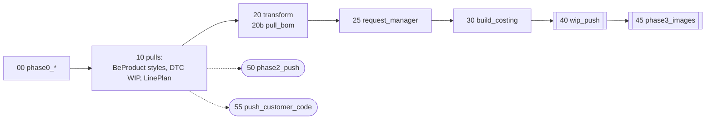

# Troubleshooting — BeProduct ⇄ DTC sync (v2)

For IT support. Five runbooks, one per reported symptom. Each runbook assumes
you have **at most three documents open**:

| Doc | What you use it for |
|---|---|
| **this file** | Symptom → checks in order → cause → fix |
| [PIPELINE.md](PIPELINE.md) | What each stage does and the exact **gates** a row must pass |
| [SYNC_CONTRACT.md](SYNC_CONTRACT.md) | Which field goes which way, the exact DTC column names, the keys |

Anything else (AGENTS.md, `docs/v1/`, MIGRATION_V1_V2.md) is history or design
rationale. You should not need it to fix a production issue.

**Runbooks**

1. [A DTC WIP record is missing](#1-a-dtc-wip-record-is-missing)
2. [A field was not pushed to BeProduct](#2-a-field-was-not-pushed-to-beproduct)
3. [No costing chart line was formed](#3-no-costing-chart-line-was-formed)
4. [A duty rate is missing](#4-a-duty-rate-is-missing)
5. [A tariff (or duty rate / HTS) is outdated](#5-a-tariff-or-duty-rate--hts-is-outdated)
6. [The job itself fails](#6-the-job-itself-fails)

---

## 0. Before any runbook

### 0.1 The two jobs and when they run

| Job | Id | Schedule (HKT) | Does |
|---|---|---|---|
| `BeProduct_DTC_sync_v2` | 367710575109755 | every **15 min** at :05 / :20 / :35 / :50 (~3.5 min per run) | everything except NT Orbit |
| `BeProduct_DTC_sync_duty_compute` | 1026599988408090 | every **15 min** at :12 / :27 / :42 / :57 (~30 s in steady state) | NT Orbit lookups → `nt_orbit_duty_cache` + `costing_chart`. Never touches DTC |

`BeProduct_DTC_sync_dag` (v1) and `BeProduct_DTC_sync_images` are **paused**.
If either is running, someone un-paused it. Pause it again.

Main-job stages, in order (the details are in PIPELINE.md):



### 0.2 Timing: "it didn't sync" is often "it hasn't synced yet"

| Change made | Earliest it shows up |
|---|---|
| Style edited in BeProduct | the next main run (≤ 15 min, plus ~4 min run time) |
| Value typed into DTC (vendor, factory, Lineplan Ref #, Lot# …) | the next main run. `pull_master_dtc` takes its snapshot at the start of the run, so a save made mid-run waits for the run after |
| A new costing line that needs an NT Orbit lookup | the next `duty_compute` (:12 / :27 / :42 / :57), then the next main run. Allow ~30 min end to end |
| Techpack / BOM extraction updated | the next main run, provided the Lakebase row is already there |

### 0.3 Check these first — they explain most reports

1. **Did the relevant run succeed?** Databricks → Jobs → the job → Runs.
   Every edge is `run_if=ALL_DONE`, so a failed stage does not stop later ones.
   **A green run can still contain a failed task.** Open each task.
2. **`dry_run`.** Must be `false` on the job. With `true`, everything is computed
   and logged, but nothing is written.
3. **`run_*` flags.** A disabled stage still shows **SUCCESS**. Its exit value
   reads `SKIPPED_run_<flag>_false`. Flags: `run_phase0`, `run_bom`,
   `run_costing`, `run_wip_push`, `run_duty_push`, `run_phase3`, `run_phase2`,
   `run_customer_code_push` (this one is `false` on purpose).
4. **`folder_name`.** Currently **`TEST KTB`**, not `KTB`, until go-live. A style
   in any other BeProduct folder is invisible to the pipeline.

### 0.4 Where the evidence is

**Task exit value.** All tasks run serverless, and the Jobs API returns **no
stdout** for serverless runs. The exit value is the only machine-readable
output. Read it in the run UI (task → Output), or collect every task's exit
value at once:

```bash
python scripts/run_v2_job.py --job-id 367710575109755 dry_run=true   # no DTC / BeProduct writes (Delta tables still rebuilt)
python scripts/run_v2_task.py v2_wip_push dry_run=true               # one task, one-off run
```

What each exit value tells you:
- `wip_push`: counts per request, `columns_changed`, `stranded_rows`,
  `violations`, `degraded`, and `sample_changes` (current vs new values).
- `build_costing`: **per-gate drop counts**. This is the main tool for
  runbook 3.
- `phase2_push` and `duty_compute` exit no summary. Use the log table (phase 2)
  or the task's cell output in the UI (duty_compute).

**Log tables** (`lft.beproduct.*`, append-only, filter on `run_id` /
`log_time`):

| Table | Written by | Useful columns |
|---|---|---|
| `beproduct_to_dtc_sync_log` | `stage` = `resolve` / `create` / `share` / `registry_audit` (request_manager), `wip_push`, `images` | `dtc_request_name`, `operation` (`INSERT`/`UPDATE`/`NOOP`/`EXCEPTION`/`STRANDED_ROWS`/`REQUEST_INACTIVE`/`NOT_IN_SCOPE`/`DUPLICATE_ACTIVE_NAME`/`COLUMN_NOT_IN_VIEW`…), `status`, `reason`, `payload`. **`lf_style_number` holds the BP Style#** |
| `dtc_to_beproduct_sync_log` | `phase2_push` | `lf_style_number` (BP Style#), `operation`, `status`, `reason` (`no_beproduct_identity`, `missing_style_id`, `header_value_conflict` …), `payload` |

**State tables** (`lft.beproduct.*`):

| Table | Grain | Rewritten |
|---|---|---|
| `ktb_styles` | BeProduct style | every run (FULL) |
| `beproduct_to_dtc_staging` | style × colour, with `dtc_request_name` | every run |
| `bom_segments` | style, raw techpack BOM + `main_fabric_count` / `parse_error` | every run |
| `dtc_request_registry` / `dtc_request_mapping` | DTC request | every run |
| `dtc_wip_ktb` | DTC WIP row (`data_json` holds every cell) | every run — a **start-of-run** snapshot |
| `dtc_lineplan_ktb` | LinePlan row | every run |
| `costing_chart` | style × colour × material × vendor slot | **fully overwritten** every main run, and MERGEd by duty_compute |
| `nt_orbit_duty_cache` | (description, origin, market) | never wiped |

All of these are Delta tables, so the history is kept:
`DESCRIBE HISTORY lft.beproduct.costing_chart` and
`SELECT … FROM lft.beproduct.dtc_wip_ktb VERSION AS OF <n>` show you what a
table held before a given run.

Most queries below read one DTC cell out of `data_json`, like this:

```sql
get_json_object(data_json, "$['Mill Fabric Article #']")
```

---

## 1. A DTC WIP record is missing

*"Style X / colour Y is not in the DTC WIP sheet"*, or *"it has fewer
material rows than the BOM"*.

The grain is **style × colour × material**. First decide which case you have:
- **The whole style × colour is missing** → work through 1.1–1.7.
- **The style × colour is there but a material row is missing** → go to 1.8.

Start with one query:

```sql
SELECT bp_style_number, color, dtc_request_name, sync_status
FROM lft.beproduct.beproduct_to_dtc_staging
WHERE bp_style_number = 'KTB-00029';
```

### 1.1 Not in staging at all

Check each of these in order:

- **Is the style in `ktb_styles`?** Check
  `SELECT bp_style_number, product_status FROM lft.beproduct.ktb_styles WHERE bp_style_number = '…'`.
  If it is absent, the style is not in the BeProduct folder `folder_name`
  (0.3 #4), or `bp_style_sync` failed.
- **Is the style terminal?** A `Finalized` / `Drop` style gets one last push of
  its status and is then excluded. This is by design (PIPELINE.md → Stage 20,
  gate 3). The fix is to reactivate the style in BeProduct.
- **Did `transform` fail?** Stage 20 **raises** on a null `bp_style_number`,
  season code, brand or colour. The usual cause is a BeProduct season/year with
  no row in `dtc_seasoncode_mapping` (Stage 20, gates 5–6). When `transform`
  fails, staging keeps the **previous** run's content, so new styles never
  appear. The fix is to add the mapping row
  (`dtc/notebooks/00_init_season_mapping.py`) and re-run.
- **A colourless style is not missing.** It stages as one row with
  `Color / Wash = "NO BP COLORWAY"`. Look for that row in DTC.

### 1.2 In staging, but its request did not resolve

Check the request name shown in `dtc_request_name`:

```sql
SELECT operation, status, reason, detail FROM lft.beproduct.beproduct_to_dtc_sync_log
WHERE stage IN ('resolve','create','share','registry_audit')
  AND dtc_request_name = 'KTB SS28 Wrangler Collaborations'
ORDER BY log_time DESC LIMIT 20;
```

| `operation` / `reason` | Cause | Fix |
|---|---|---|
| `NOT_IN_SCOPE` | The name does not parse as `<customer> <seasonCode> <brand>` (e.g. brand blank) | Fix the brand/season in BeProduct |
| `DUPLICATE_ACTIVE_NAME` | Two active DTC requests share this name, so the pipeline refuses to pick one | A DTC admin must deactivate or rename one |
| created, but only in `dry_run` | Creation is skipped when `dry_run=true` | Run with `dry_run=false` |

Scope rules are in PIPELINE.md → Stage 10. A request whose **name** contains
*cancel / backup / archive / delete* or `-SUPPLIER` is out of scope **by
design**. If the users renamed the real request that way, its rows stop
syncing.

### 1.3 Resolved, but `wip_push` refused the row

```sql
SELECT log_time, operation, status, reason, detail, payload
FROM lft.beproduct.beproduct_to_dtc_sync_log
WHERE stage = 'wip_push' AND lf_style_number = 'KTB-00029'   -- holds BP Style#
ORDER BY log_time DESC LIMIT 50;
```

| `reason` | Meaning | Fix |
|---|---|---|
| `missing_bp_style` | The staging row has no BP Style# | Fix it in BeProduct |
| `season_mismatch` / `brand_mismatch` | A row with this key already sits in a request of another season or brand | See 1.5 |
| `duplicate_bp_key` | Two staging rows share (BP Style#, colour) | A duplicate colourway name in BeProduct |
| `missing_row_id` | The DTC row came back without a rowId | Transient. Re-run |
| `request_inactive_at_push` | The request was deactivated during the run | The next run recreates it (Stage 25) |
| `sheet_read_failed` / `error` on INSERT or UPDATE | A DTC API error. The `detail` column holds the response | Re-run. If it repeats, check DTC API health |

If there is **no log row at all** for the style, `wip_push` did not run, was
disabled, or its request was not in `dtc_request_mapping`. Go back to 1.2.

### 1.4 The log says INSERT ok, but the user cannot see the row

- Was the run `dry_run`? Then `reason = dry_run`.
- Is the user in the right request (season + brand) and view? The row is
  written through the `WIP_ITS_USE` view.
- The user's browser session is stale. Any write makes DTC refuse saves from
  sessions loaded earlier. Ask the user to **reload**.

### 1.5 The row moved to a different request

A changed BP Style#, brand or season changes the target request. The pipeline
INSERTs the row into the new request and marks the old one
`Product Status = "(removed)"`. It **never deletes** the old row
(PIPELINE.md → Stage 40, "Moved-key orphans"). Look in the other request.

### 1.6 A user deleted it

The next run re-INSERTs it, because the key is missing from DTC. The
DTC-owned values the user had typed (vendor, factory, Lineplan Ref #) do
**not** come back. Recover them from
`dtc_wip_ktb VERSION AS OF <version before the delete>`.

### 1.7 The opposite: DTC has a row BeProduct does not

This is a **stranded row**, e.g. a colourway deleted in BeProduct or typed
straight into DTC. It is reported in `wip_push`'s exit value as
`stranded_rows`, and as `operation = STRANDED_ROWS` in the log. It is never
written or deleted. Keeping or removing it is a data-owner decision.

### 1.8 Style × colour is there, a material row is missing

Material rows come from the techpack BOM (PIPELINE.md → Stage 20b and Stage 40,
"Gates — material fields"). The expected count per colour is
**1 + the number of "Fabric" segments**.

```sql
SELECT bp_style_number, style_season, main_fabric_count, fabric_count, parse_error
FROM lft.beproduct.bom_segments WHERE bp_style_number = 'KTB-00029';
```

| What you see | Cause | Fix |
|---|---|---|
| No row | The techpack BOM is not in Lakebase for this style. The join is `style_no` + `"<season> - <year>"` | The extraction has not landed yet. Wait, or ask the techpack team |
| `main_fabric_count = 0` | **No "Main Fabric" segment, so zero actions for the whole style** (material gate 2). DTC keeps `Fabric Group = "NO TPM BOM"` | Fix the BOM so exactly one segment has `**MaterialCategory = Main Fabric` |
| `parse_error` set | Malformed payload | Fix the techpack data |
| Counts look right, rows still missing | Check the `wip_push` log for this style: `degraded` or `violations` in its exit value | See material gates 3–5. A row carrying some **other** real article # is deliberately left alone, so a changed article can look like a "missing" new row |

`pull_bom` disabled (`run_bom=false`) freezes the BOM at the last value it
read.

---

## 2. A field was not pushed to BeProduct

*"I entered the vendor / factory / Lot# in DTC but BeProduct still shows the
old value."*

### 2.1 Is it a DTC → BeProduct field at all?

Only these travel that direction (SYNC_CONTRACT.md → "DTC → BeProduct"):
`Main Vendor (Sampling)`, `Main Factory (Sampling)`, `Main Factory Customer
ID`, `Factory Production Country for Main Factory` (→ COO), `Lot#`. Also
`Fabric Customer # or SAP #` (→ material master), which is **disabled** on
purpose (`run_customer_code_push=false`, PIPELINE.md → Stage 55).

Any other column is BeProduct → DTC, and a DTC edit to it is **overwritten** on
the next run. That is correct behaviour: the value must be changed in
BeProduct.

### 2.2 Did the pipeline see the value?

`phase2_push` reads the `dtc_wip_ktb` snapshot taken at the **start** of the run
(0.2):

```sql
SELECT request_reference, bp_style_number, color_wash,
       get_json_object(data_json, "$['Main Vendor (Sampling)']")  AS vendor,
       get_json_object(data_json, "$['Main Factory (Sampling)']") AS factory,
       get_json_object(data_json, "$['Factory Production Country for Main Factory']") AS coo,
       get_json_object(data_json, "$['Main Factory Customer ID']") AS cust_factory_id
FROM lft.beproduct.dtc_wip_ktb WHERE bp_style_number = 'KTB-00024';
```

If the value is blank here but visible in DTC, one of two things happened:
- The value was saved after the snapshot. Wait for the next run.
- **It is a DTC lookup field that was never materialized.** `Main Factory
  Customer ID` and every `Factory Production Country for …` column are
  *lookups* on the factory. DTC only computes and stores a lookup if the column
  is **on the view the user saved through**. Users save through **"Full"**. If
  the column is hidden there, the stored cell stays NULL although the UI shows
  a value. The fix is DTC view configuration: expose the column on the Full
  view, then have the user re-save the row.

### 2.3 What did `phase2_push` decide?

```sql
SELECT log_time, operation, status, reason, detail, payload
FROM lft.beproduct.dtc_to_beproduct_sync_log
WHERE lf_style_number = 'KTB-00024' ORDER BY log_time DESC LIMIT 30;
```

| `reason` | Cause | Fix |
|---|---|---|
| `no_beproduct_identity` | The DTC row's (request, BP Style#, colour) has no staging row: a stranded row (1.7), or the style moved | Fix the key, or treat it as stranded |
| `missing_style_id` / `missing_colorway_id` | No BeProduct id. `Lot#` needs a real colourway, and `NO BP COLORWAY` rows have none | Create the colourway in BeProduct |
| `header_value_conflict` | Style-level field, but **two DTC rows of the same style disagree**. That includes the several material rows of one colour, and different colours. The first value wins and the rest are flagged | Make every row of the style agree, or blank the extra ones (blanks are ignored) |
| COO not written, no error | The 2-char code did not resolve in `beproduct_master_coo`: the table is empty, or the code is unknown | Run `p5utl_beproduct_master_data_sync` with mode `PULL_ONLY` |
| no row, value blank | Blank DTC values never clear BeProduct (`push_blanks=false`) | By design |
| NOOP | BeProduct already holds that value | Nothing to do |

The gates are in PIPELINE.md → Stage 50. Also check 0.3: a `run_phase2=false`
or `dry_run=true` run still looks green.

---

## 3. No costing chart line was formed

*"Style X is in DTC WIP but has no row in `costing_chart`."*

Read `build_costing`'s exit value from the most recent main run. The
`gates` object counts every row dropped, per gate (PIPELINE.md → Stage 30,
gates 1–7). Then check the single row:

```sql
SELECT request_reference, bp_style_number, color_wash,
  get_json_object(data_json, "$['Fabric Group']")           AS fabric_group,
  get_json_object(data_json, "$['Mill Fabric Article #']")  AS article,
  get_json_object(data_json, "$['Content']")                AS content,
  get_json_object(data_json, "$['LinePlan ref#']")          AS lineplan_ref,   -- renamed 2026-09-28, was 'Lineplan Ref #' 
  get_json_object(data_json, "$['Main Vendor (Sampling)']") AS main_vendor,
  get_json_object(data_json, "$['Vendor 1']")               AS vendor_1
FROM lft.beproduct.dtc_wip_ktb WHERE bp_style_number = 'KTB-00030';
```

Walk the gates **in order**. The first one that fails is your answer:

| # | Gate | Exit-value counter | Usual cause → fix |
|---|---|---|---|
| — | stage ran | exit value is `SKIPPED_run_costing_false` | `run_costing=false` |
| 1 | `Mill Fabric Article #` non-blank | `dropped_no_material_no` | BOM not enriched yet → runbook 1.8 |
| 2 | BP Style# non-blank | `dropped_no_bp_style_no` | Row typed by hand in DTC |
| 3 | `Content` non-blank and not `"Main Fabric"` | `dropped_blank_content` | `**MaterialContent` blank in the techpack. Fill it at the source, or type it in DTC (Content is write-once, so a hand value is kept) |
| 4 | `Fabric Group` is exactly `Main Fabric` | `dropped_not_main_fabric` | **By design.** "Fabric" segment rows never get a costing line. Only the Main Fabric row does |
| 5 | `LinePlan ref#` non-blank | `dropped_no_lineplan_ref` | Users must enter it **on the Main Fabric row**. It is DTC-owned, and the pipeline never fills it. **If it drops EVERY row**, check the column was not renamed in DTC again: the names the pipeline accepts are in `sync/lineplan.py`, and the dashboard flags `LINEPLAN_COLUMN_RENAMED` |
| 6 | Ref matches a LinePlan row | `joined_to_lineplan` too low | Typo, or the LinePlan request is not active. Check `dtc_lineplan_ktb` |
| 7 | At least one vendor slot filled | `dropped_no_vendor_slot` | Enter `Main Vendor (Sampling)` or `Vendor 1–3` on the Main Fabric row |

Rules of thumb:
- All DTC-owned inputs (Lineplan Ref #, vendors, factories) belong on the
  **Main Fabric** row. Costing reads one representative row per style ×
  colour, and prefers Main Fabric.
- If a request was emptied or rebuilt, **these DTC-owned values are gone** and
  nothing upstream restores them. The whole request then drops at gate 5.
  Recover the values from `dtc_wip_ktb VERSION AS OF <n>` and re-enter them.
- A LinePlan ref that exists twice with different plan values is a warning in
  the task output (`CONFLICTING`). It does not block, but the chosen values are
  arbitrary. The fix is to make refs unique in LinePlan.
- `costing_chart` is rebuilt from scratch every main run. A line that
  "disappeared" means a gate started failing. Compare
  `DESCRIBE HISTORY lft.beproduct.costing_chart` versions.

---

## 4. A duty rate is missing

*"The costing line exists but `hts_code` / `duty_rate_us|ca|mx` / `tariff_rate`
is blank"*, either in `costing_chart` or in the DTC WIP duty columns.

```sql
SELECT bp_style_no, color_name, material_no, supplier_type, supplier, factory,
       production_country, hts_code, duty_rate_us, duty_rate_ca, duty_rate_mx, tariff_rate
FROM lft.beproduct.costing_chart WHERE bp_style_no = 'KTB-00029';
```

### 4.1 Blank in `costing_chart`

| Check | Cause | Fix |
|---|---|---|
| `production_country` blank | **No lookup is ever made for a blank origin, and no error is logged.** Either `Factory` / `Factory N` is blank on the row, or the country lookup was not materialized (2.2, the view-at-save rule) | Enter the factory, and make sure the country column is on the Full view. Country follows the **factory**, not the vendor |
| Line is new since the last `duty_compute` | Lookups only happen in `duty_compute`, every 15 min | Wait, or run `BeProduct_DTC_sync_duty_compute` now, then the main job |
| `duty_compute` failed or reported `failed: N` | NT Orbit error or timeout (calls take ~30–60 s each) | Re-run. Failed markets are retried next time |
| `duty_compute` fails with `NT Orbit /api/v1/health check failed`, or an Entra `AADSTS…` error | The refresh token is dead: the job has not run for ~90 days, or the signed-in account lost access | See 4.3 |
| Only `tariff_rate` blank | Tariff only comes from the **US** call | Same as the rows above. US is re-queried whenever tariff is blank |
| Only CA/MX blank | That market's call failed | Re-run `duty_compute` |
| Row is a "Fabric" segment | Never gets duty, **by design** (Stage 30, gate 4) | — |

The gates are in PIPELINE.md → "Companion jobs" → duty_compute, "which markets
need a call".

### 4.2 Filled in `costing_chart`, blank in DTC

| Check | Cause | Fix |
|---|---|---|
| `wip_push` exit value: `run_duty_push`, or `duty_rows_matched` low | Duty push disabled, or the costing line did not find its WIP row | The join is **(BP Style#, colour, Mill Fabric Article #)**. An article # changed in DTC after costing breaks it until the next rebuild |
| `columns_not_seen_in_view` lists the duty column | Column missing or renamed in the DTC view. The value is dropped by the allow-list | Check the exact names in SYNC_CONTRACT.md → "Costing/duty → DTC". They are **not symmetric**: `Factory 1 - HTS code`, `Factory 1 - Tariff`, `Main Factory Tariff` |
| Filled by `duty_compute` **after** the main run | The value reaches DTC on the next main run (≤ 15 min) | Wait, or re-run just the push: `w.jobs.run_now(job_id=367710575109755, only=["wip_push"])` |

### 4.3 Re-authorizing NT Orbit

The job prefers the refresh token it persisted to
`lft.beproduct.nt_orbit_oauth_state` over the one in the secret scope. After
re-seeding, **both** must change, or the dead token keeps winning:

1. On a machine with the `NT_ORBIT_*` values in `.env`, run
   `python scripts/nt_orbit_oauth_setup.py` and sign in as the NT Orbit-authorized
   user. The default flow is `authcode`; use `--flow devicecode` if you have no
   browser redirect.
2. Put the printed refresh token into the secret scope:
   `databricks secrets put-secret beproduct nt_orbit_refresh_token`.
3. Remove the stale persisted token:
   `DELETE FROM lft.beproduct.nt_orbit_oauth_state WHERE provider = 'nt_orbit'`.
4. Re-run `BeProduct_DTC_sync_duty_compute`. It should print
   `NT Orbit health check OK`.

---

## 5. A tariff (or duty rate / HTS) is outdated

*"NT Orbit / policy changed but DTC and `costing_chart` still show the old
rate."*

**This is expected behaviour.** Duty values are **fill-blank-only**, at four
independent layers (PIPELINE.md → "Refreshing a duty rate that has CHANGED").
A populated value is never re-queried, and the 180-day cache TTL never fires
for it. No scheduled run will ever correct it.

**Fix: `force_refresh_duty`. Run both jobs, in this order:**

```python
w.jobs.run_now(job_id=1026599988408090, job_parameters={"force_refresh_duty": "true"})  # duty_compute
# wait until it finishes, then:
w.jobs.run_now(job_id=367710575109755,  job_parameters={"force_refresh_duty": "true"})  # main v2
```

- Do **not** clear anything by hand: not the WIP columns, not `costing_chart`,
  not the cache.
- **Order matters.** If you run only step 1, the next main run rebuilds
  `costing_chart` from the **old** WIP values and silently undoes it. If you run
  only step 2, it re-applies whatever the cache already holds.
- It costs ~30 s per row × market. Never leave it on for scheduled runs. The
  job default is `false`, and a run-time override does not change it.
- Unchanged answers write nothing, so a forced run is still lean.

Things that look like "outdated" but are not:
- **NT Orbit is not fully deterministic.** The same description has returned
  different HTS codes hours apart (~1 in 7 rows). A changed value after a
  forced refresh is **not** evidence that policy changed.
- **The HTS code is the US one.** CA and MX return different codes, but the
  single `hts_code` column is US-owned by design.
- **The description changed.** The cache is keyed on the product description
  (style description, colour, content, gender, class, sub class). Any edit to
  those makes a new cache key, so the line gets the new description's
  classification the next time it is looked up.
- **A tariff removed upstream is never cleared.** A `None` from the API is
  indistinguishable from a failure. Clear the DTC cell by hand.
- **A hand-typed tariff in DTC.** The WIP value is read back into
  `costing_chart` on every rebuild, so it is kept until a forced refresh
  overwrites it.

---

## 6. The job itself fails

| Error | Cause | Fix |
|---|---|---|
| `ModuleNotFoundError: connectors…` / `sync…` | Modules were not uploaded to the v2 root | `python scripts/upload_notebooks.py --root /Workspace/Repos/beproduct-sync-v2 --modules-only` |
| `TypeError: … unexpected keyword argument` whose traceback shows new code | The notebook imports **v1** modules. The job parameter `module_path` overrides the task's own value | The job's `module_path` must be `/Workspace/Repos/beproduct-sync-v2/DTC/python`. Every notebook prints `_MODULE_PATH` |
| `AttributeError: module 'datetime' has no attribute 'UTC'` | Serverless is Python 3.10, but the BeProduct SDK assumes 3.11 | Add the `datetime.UTC = datetime.timezone.utc` shim at the top of the notebook (see `v2_pull_bom_segments`) |
| `JVM_ATTRIBUTE_NOT_SUPPORTED` / `_jdf` | Spark Connect (serverless) does not support passing an unbound `DataFrame.<method>` | Use a lambda that calls the bound method |
| `401 Unauthorized` (DTC) | The `dtc_api_key_<env>` secret is missing or expired | Replace the secret |
| `401` / `unauthorized_client` (BeProduct) | The BeProduct refresh token expired | Update the `refresh_token` secret |
| `NO_RESOLVED_REQUESTS` (wip_push exit value) | No staging request resolved to an active, in-scope DTC request | Runbook 1.2 |
| DTC `400 Duplicate rowId found` | Two sheetData objects share a rowId in one call. Either DTC's own sheet GET returned that rowId twice (seen 2026-09-29 on a LinePlan sheet), or a regression in the duty merge | **Check first**: does a live `GET /v1/sheets/{s}/views/{v}` list the rowId twice? If so, report it to DTC; we deliberately do not merge on our side. Otherwise it is the duty merge (PIPELINE.md → Stage 40, duty gate 4) |
| DTC `400 … is an image field` / `… is a formula field` | An INSERT copied a non-writable column | A regression in `bom.build_insert_row_payload` (Stage 40, material gate 7) |
| Image upload `Row cannot be found by rowid` | The row was deleted between the read and the upload | The next run retries |
| A BeProduct field went blank after a push | BeProduct silently blanks a DropDown/MultiSelect value that is not in that field's Master Data, or a MultiSelect sent as a bare string | Check the value against `lft.beproduct.beproduct_master_<field>` (refresh with `p5utl_beproduct_master_data_sync` `PULL_ONLY`); fix the value in DTC |

---

## Tools

| Need | Tool |
|---|---|
| **Start here:** every current gap, who fixes it, what to do | Dashboard **BeProduct DTC - Data gaps** (view `lft.beproduct.v_data_gaps`). Deploy/update: `python scripts/deploy_gap_dashboard.py`. Each row names its runbook |
| Run the whole job without writing | `python scripts/run_v2_job.py --job-id 367710575109755 dry_run=true` |
| Run one notebook one-off | `python scripts/run_v2_task.py <notebook> key=value …` |
| Re-run selected tasks of the job | `w.jobs.run_now(job_id=…, only=["wip_push"])` |
| List DTC requests and why each is in or out of scope | `dtc/notebooks/v2_inspect_requests.py` (read-only) |
| Set **one** DTC cell safely | `dtc/notebooks/v2_set_dtc_cell.py` (matches BP Style# + colour + article; refuses on ambiguity; reads the value back) |
| See a table as it was | `DESCRIBE HISTORY …` / `VERSION AS OF n` / `RESTORE TABLE … VERSION AS OF n` |
| Check a DTC view's real columns | `python scripts/check_dtc_view.py`. The view definition is authoritative. A column blank on every row is **invisible** in `dtc_wip_ktb` |

**Before running anything with `dry_run=false`:** the change goes to live DTC
and locks out any user with that request open. Prefer the scheduled run.
